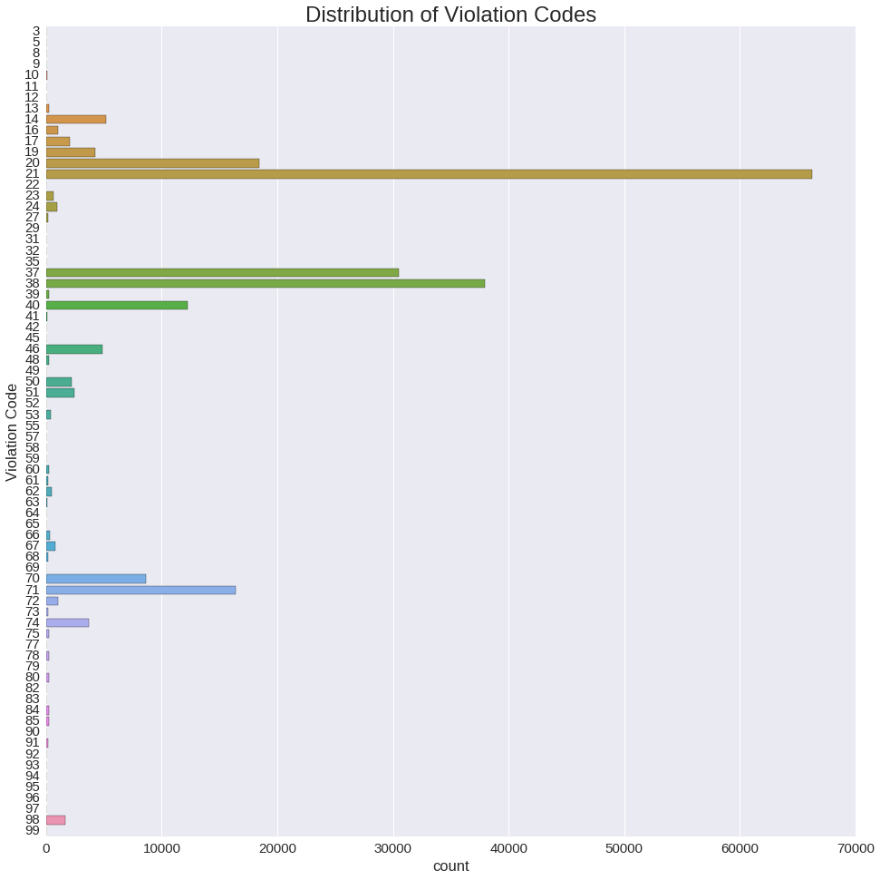
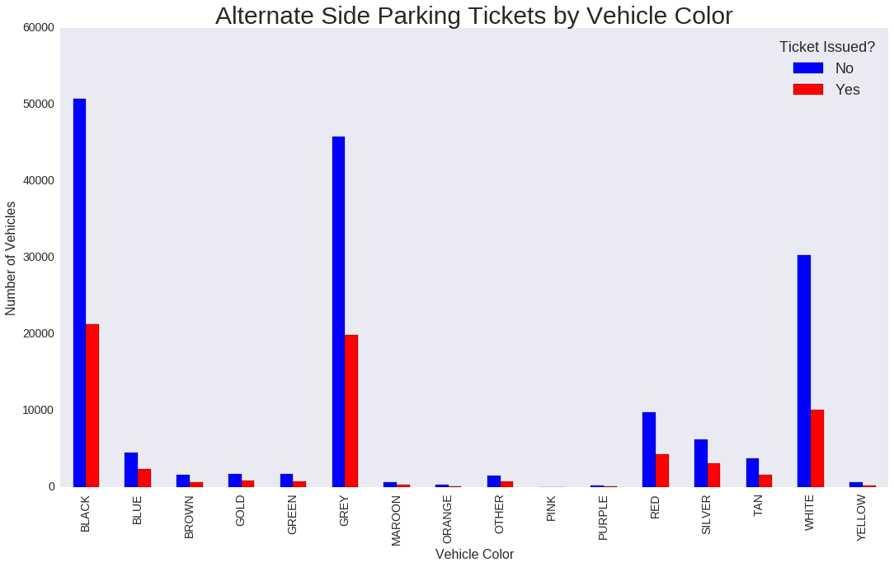

# Parking Violations Issued by New York City (FY16)

### Parking a car in the city is a miserable experience. This project will attempt to make it slightly less miserable through data science.

As part of New York's open data policy, the full dataset of parking violations issued each fiscal year is made publicly available. This project will explore the dataset from FY16. The full dataset contains over 10 million observations, but only data from passenger vehicles in NYPD Precinct 114 (which covers the northwest corner of Queens, including Astoria, Long Island City, and parts of Woodside and Jackson Heights) will be used.

# The Goal

The goal of the project is to discover if it is possible to predict whether a vehicle was issued a ticket for breaking alternate side parking rules (Violation Code 21) using information that could be known beforehand like vehicle make, vehicle color, and time of day.

# Project Summary

1. Isolate the relevant data.
2. Clean, clean, clean.
3. Decision Trees and Random Forests


```python
import numpy as np
import pandas as pd
import matplotlib.pyplot as plt
import seaborn as sns
from sklearn import ensemble, cross_validation, neighbors, tree, metrics

from IPython.display import Image
%matplotlib inline

# Set the default figure size for plotting
sns.mpl.rc("figure", figsize=(40,20))  # Larger default plots
sns.set_context("notebook", font_scale=1)  # Larger fonts
```

## Exploratory Analysis of Precinct 114


The dataset contains mostly categorical data across 43 columns. There are four columns that contain no data and fifteen more that have missing data. A closer look shows that several of the fields are cryptically coded and might take some work to unpack, but there are enough columns that contain understandable information and are either complete or only missing a few values.


```python
df = pd.read_csv('Parking_Violations_Issued_-_Fiscal_Year_2016.csv')
```


```python
df.info()
```

    <class 'pandas.core.frame.DataFrame'>
    RangeIndex: 10173437 entries, 0 to 10173436
    Data columns (total 43 columns):
    Summons Number                       int64
    Plate ID                             object
    Registration State                   object
    Plate Type                           object
    Issue Date                           object
    Violation Code                       float64
    Vehicle Body Type                    object
    Vehicle Make                         object
    Issuing Agency                       object
    Street Code1                         float64
    Street Code2                         float64
    Street Code3                         float64
    Vehicle Expiration Date              float64
    Violation Location                   float64
    Violation Precinct                   float64
    Issuer Precinct                      float64
    Issuer Code                          float64
    Issuer Command                       object
    Issuer Squad                         object
    Violation Time                       object
    Time First Observed                  object
    Violation County                     object
    Violation In Front Of Or Opposite    object
    House Number                         object
    Street Name                          object
    Intersecting Street                  object
    Date First Observed                  float64
    Law Section                          float64
    Sub Division                         object
    Violation Legal Code                 object
    Days Parking In Effect               object
    From Hours In Effect                 object
    To Hours In Effect                   object
    Vehicle Color                        object
    Unregistered Vehicle?                object
    Vehicle Year                         float64
    Meter Number                         object
    Feet From Curb                       float64
    Violation Post Code                  object
    Violation Description                object
    No Standing or Stopping Violation    float64
    Hydrant Violation                    float64
    Double Parking Violation             float64
    dtypes: float64(16), int64(1), object(26)
    memory usage: 3.3+ GB


```python
df = df[((df['Violation Precinct'] == 114) & (df['Plate Type'] == 'PAS'))]
```


```python
df.shape
```


    (225619, 43)


```python
'''
time24 = []
for time in df['Violation Time']:
    hourminute = time[:4]
    ampm = time[-1:]
    if hourminute[0] not in ('0','1', '2'):
        hourminute = '0' + hourminute[1:]
    if hourminute[1] not in ('0','1','2','3','4','5','6','7','8','9'):
        hourminute = '00' + hourminute[2:]
    if hourminute[3] not in ('0','1','2','3','4','5','6','7','8','9'):
        hourminute = hourminute[:3] + '0'
    if ampm == 'P':
        if hourminute[:2] == '12':
            time24.append('00:' + hourminute[2:4] + ':00')
        else:
            hourminute = str(int(hourminute) + 1200)
            time24.append(hourminute[:2] + ':' + hourminute[2:4] + ':00')
    else:
        time24.append(hourminute[:2] + ':' + hourminute[2:4] + ':00')
        
df['Time'] = time24
'''
hour = []
minute = []
for time in df['Violation Time']:
    hourminute = time[:4]
    ampm = time[-1:]
    if hourminute[0] not in ('0','1', '2'):
        hourminute = '0' + hourminute[1:]
    if hourminute[1] not in ('0','1','2','3','4','5','6','7','8','9'):
        hourminute = '00' + hourminute[2:]
    if hourminute[3] not in ('0','1','2','3','4','5','6','7','8','9'):
        hourminute = hourminute[:3] + '0'
    if ampm == 'P':
        if hourminute[:2] == '12':
            hour.append(00)
            minute.append(int(hourminute[2:4]))
        else:
            hourminute = str(int(hourminute) + 1200)
            hour.append(int(hourminute[:2]))
            minute.append((hourminute[2:4]))
    else:
        hour.append(int(hourminute[:2]))
        minute.append(int(hourminute[2:4])) 
        
df['Hour'] = hour
df['Minute'] = minute
```


```python
day = []
month = []
year = []

for date in df['Issue Date']:
    day.append(int(date[:2]))
    month.append(int(date[3:5]))
    year.append(int(date[6:]))
    
df['Day'] = day
df['Month'] = month
df['Year'] = year
```


```python
def prep_df(df):
    #df['Datetime'] = pd.to_datetime(df['Issue Date'], infer_datetime_format=True)
    #df['Time'] = pd.to_datetime(df['Time'], format="%H:%M:%S")
    #df['Datetime'] = df['Issue Date'] + df['Time']
    
    df['Vehicle Year'] = df['Vehicle Year'].astype(int)
    
    return  df[[
             'Registration State', 
             'Vehicle Make',
             'Vehicle Body Type',
             'Violation Code', 
             'Vehicle Color',
             'Vehicle Year',
             'Street Code1',
             'Street Code2',
             'Street Code3',
             'Year',
             'Month',
             'Day',
             'Hour',
             'Minute']]
```

## Fixing Inconsistencies in Values and Dealing with Missing Values.

Looking at df_astoria_focused.info() shows that _Vehicle Make_, _Vehicle Color_, and _Vehicle Body Type_ are each missing a few values. The values in those fields are also wildly inconsistent. As an example, the _Vehicle Color_ column has the following variations of black: BK, BLACK, BLK, and possibly BL (which could also mean blue).


```python
df['Vehicle Color'][df['Vehicle Color'].isin(['BLK', 'BLACK', 'BLCK', 'BLAK', 'BLAC', 'BL', 'B'])].value_counts()
```


    BLACK    19090
    BL       14848
    BLK       1031
    BLCK         7
    BLAC         2
    BLAK         1
    B            1
    Name: Vehicle Color, dtype: int64


```python
df.columns
```


    Index([u'Summons Number', u'Plate ID', u'Registration State', u'Plate Type',
           u'Issue Date', u'Violation Code', u'Vehicle Body Type', u'Vehicle Make',
           u'Issuing Agency', u'Street Code1', u'Street Code2', u'Street Code3',
           u'Vehicle Expiration Date', u'Violation Location',
           u'Violation Precinct', u'Issuer Precinct', u'Issuer Code',
           u'Issuer Command', u'Issuer Squad', u'Violation Time',
           u'Time First Observed', u'Violation County',
           u'Violation In Front Of Or Opposite', u'House Number', u'Street Name',
           u'Intersecting Street', u'Date First Observed', u'Law Section',
           u'Sub Division', u'Violation Legal Code', u'Days Parking In Effect    ',
           u'From Hours In Effect', u'To Hours In Effect', u'Vehicle Color',
           u'Unregistered Vehicle?', u'Vehicle Year', u'Meter Number',
           u'Feet From Curb', u'Violation Post Code', u'Violation Description',
           u'No Standing or Stopping Violation', u'Hydrant Violation',
           u'Double Parking Violation', u'Hour', u'Minute', u'Day', u'Month',
           u'Year'],
          dtype='object')


```python
def clean_df(df):
    df.replace({'Vehicle Color': {'BL':'BLACK',
                                  'BK':'BLACK',
                                  'BLK':'BLACK',
                                  'BLCK':'BLACK',
                                  'BLACL':'BLACK',
                                  'BK/' : 'BLACK',
                                  'BKG' : 'BLACK',
                                  'BKR' : 'BLACK',
                                  'BLAC' : 'BLACK',
                                  'BKW' : 'BLACK',
                                  'BLB' : 'BLACK',
                                  'BL WH' : 'BLACK',
                                  'BLC' : 'BLACK',
                                  'BLN' : 'BLACK',
                                  'BCK' : 'BLACK',
                                  'BG' : 'BLACK',
                                  'BKYE' : 'BLACK',
                                  'B LAC' : 'BLACK',
                                  'BLAK' : 'BLACK',
                                  'B' : 'BLACK',
                                  'WH':'WHITE',
                                  'WHTIE':'WHITE',
                                  'WH':'WHITE',
                                  'WHTE': 'WHITE',
                                  'WH/' : 'WHITE',
                                  'WHT' : 'WHITE',
                                  'WHG' : 'WHITE',
                                  'WT' : 'WHITE',
                                  'W' : 'WHITE',
                                  'WHB' : 'WHITE',
                                  'WHR' : 'WHITE',
                                  'WHIET' : 'WHITE',
                                  'WHI' : 'WHITE',
                                  'WTE' : 'WHITE',
                                  'WHBK' : 'WHITE',
                                  'WHO' : 'WHITE',
                                  'WHY' : 'WHITE',
                                  'WH/OR' : 'WHITE',
                                  'WH/RD' : 'WHITE',
                                  'WH/BL' : 'WHITE',
                                  'WHIT' : 'WHITE',
                                  'KWH' : 'WHITE',
                                  'GY' : 'GREY',
                                  'GY/': 'GREY',
                                  'GRY' : 'GREY',
                                  'GAY' : 'GREY',
                                  'GR' : 'GREY',
                                  'GRAY': 'GREY',
                                  'GYW' : 'GREY',
                                  'GYB' : 'GREY',
                                  'DK GY' : 'GREY',
                                  'GRG' : 'GREY',
                                  'DARK' : 'GREY',
                                  'GRET' : 'GREY',
                                  'GRETY' : 'GREY',
                                  'LIGHT' : 'GREY',
                                  'GRR' : 'GREY',
                                  'DKGY' : 'GREY',
                                  'GRT' : 'GREY',
                                  'GERY' : 'GREY',
                                  'FRAY' : 'GREY',
                                  'DRKGY' : 'GREY',
                                  'DKGRY' : 'GREY',
                                  'GLT' : 'GREY',
                                  'GRW' : 'GREY',
                                  'GRT' : 'GREY',
                                  'GRAT' : 'GREY',
                                  'GYT' : 'GREY',
                                  'G' : 'GREY',
                                  'GU' : 'GREY',
                                  'GRE' : 'GREY',
                                  'GBY' : 'GREY',
                                  'RD' : 'RED',
                                  'RDB' : 'RED',
                                  'RD/' : 'RED',
                                  'RDO' : 'RED',
                                  'RDG' : 'RED',
                                  'RE' : 'RED',
                                  'RDY' : 'RED',
                                  'OR' : 'ORANGE',
                                  'RDT' : 'RED',
                                  'TN': 'TAN',
                                  'DKT' : 'TAN',
                                  'BEIGE' : 'TAN',
                                  'LTT' : 'TAN',
                                  'TNG' : 'TAN',
                                  'TN/' : 'TAN',
                                  'BEIGD' : 'TAN',
                                  'TANQ' : 'TAN',
                                  'BIEGE' : 'TAN',
                                  'BRIGE' : 'TAN',
                                  'BEIDG' : 'TAN',
                                  'BEGIE' : 'TAN',
                                  'YW' : 'YELLOW',
                                  'BR' : 'BROWN',
                                  'BRN' : 'BROWN',
                                  'BROW' : 'BROWN',
                                  'BWN' : 'BROWN',
                                  'BN' : 'BROWN',
                                  'BRW' : 'BROWN',
                                  'BRO' : 'BROWN',
                                  'BR/' : 'BROWN',
                                  'BRM' : 'BROWN',
                                  'BRE' : 'BROWN',
                                  'BW' : 'BROWN',
                                  'BRT' : 'BROWN',
                                  'BOWN' : 'BROWN',
                                  'GL' : 'GOLD', 
                                  'GLD' : 'GOLD',
                                  'GL/' : 'GOLD',
                                  'GD' : 'GOLD',
                                  'ORAN': 'ORANGE',
                                  'ORANG' : 'ORANGE',
                                  'OR' : 'ORANGE',
                                  'ORNAG' : 'ORANGE',
                                  'OR/' : 'ORANGE',
                                  'GRN' :'GREEN',
                                  'GN' : 'GREEN',
                                  'TEAL' : 'GREEN',
                                  'LIME' : 'GREEN',
                                  'GLG' : 'GREEN',
                                  'BLU' : 'BLUE',
                                  'SILVE' : 'SILVER',
                                  'SLIVE' : 'SILVER',
                                  'YELLO' : 'YELLOW',
                                  'YL' : 'YELLOW',
                                  'YLLW' :'YELLOW',
                                  'YELL' : 'YELLOW',
                                  'YEL' : 'YELLOW',
                                  'YLW' : 'YELLOW',
                                  'BK/GY' : 'BLACK',
                                  'LT/' : 'GREY',
                                  'DK' : 'GREY',
                                  'DK/' : 'GREY',
                                  'LTG': 'GREY',
                                  'GRU' : 'GREY',
                                  'SILV' : 'SILVER',
                                  'SLVR' : 'SILVER',
                                  'SL' : 'SILVER',
                                  'MR' : 'MAROON',
                                  'DKR' : 'MAROON',
                                  'MAROO' : 'MAROON',
                                  'BURG' : 'MAROON',
                                  'BURGU' : 'MAROON',
                                  'BUR' : 'MAROON',
                                  'BURGA' : 'MAROON',
                                  'BU' : 'MAROON',
                                  'DKM' : 'MAROON',
                                  'MATOO' : 'MAROON',
                                  'MD' : 'MAROON',
                                  'MR/' : 'MAROON',
                                  'GR/' : 'GREY',
                                  'DKB' : 'BLUE',
                                  'DKG' : 'GREEN',
                                  'SILVR':'SILVER',
                                  'SIL' : 'SILVER',
                                  'SLV' : 'SILVER',
                                  'SIKLV' : 'SILVER',
                                  'PURPL' : 'PURPLE',
                                  'PR' : 'PURPLE',
                                  'PR/' : 'PURPLE',
                                  'LAVEN' : 'PURPLE',
                                  'DKP' : 'PURPLE',
                                  'LN' : 'PURPLE',
                                  'YW/' : 'YELLOW',
                                  'YWB' : 'YELLOW',
                                  'Y/W' : 'YELLOW',
                                  'YW/BK' : 'YELLOW',
                                  'LTB' : 'BLUE',
                                  'BL/' : 'BLUE',
                                  'BLG' : 'BLUE',
                                  'BLW' : 'BLUE',
                                  'NAVY' : 'BLUE',
                                  'BLV' : 'BLUE',
                                  'PK' : 'PINK',
                                  'NO' : 'OTHER',
                                  'NOC' : 'OTHER',
                                  'TI I' : 'OTHER',
                                  'PLE' : 'OTHER',
                                  'MULTI' : 'OTHER',
                                  'IM' : 'OTHER',
                                  'BUICK' : 'OTHER',
                                  'SUBAR' : 'OTHER',
                                  'FORD' : 'OTHER',
                                  'GC' : 'OTHER',
                                  'GV' : 'OTHER',
                                  'LEXUS' : 'OTHER',
                                  'BJ' : 'OTHER',
                                  'CADIL' : 'OTHER',
                                  'BET' : 'OTHER',
                                  'VAN' : 'OTHER'
                                  }}, inplace=True)
    
    # Cleaning up the values in the 'Vehicle Body Type' field
    df.replace({'Vehicle Body Type': {'P-U':'PICKUP',
                                      'TK':'PICKUP',
                                      'SEDN' : 'SDN',
                                      'TR' : 'TRAC',
                                      'TRUC' : 'PICKUP',
                                      'T/CR' : 'TRAC',
                                      'TR/C' : 'TRAC',
                                      'UTII' : 'UTIL',
                                     }}, inplace=True)
    
    # Cleaning up the values in the 'Vehicle Makes' field
    df.replace({'Vehicle Make': {'5AAB':'SAAB',
                                 'AACUR' : 'ACURA',
                                 'BEN' : 'BENTL',
                                 'BENTI' : 'BENTL',
                                 'DUCET' : 'DUCAT',
                                 'FRIE' : 'FRIG',
                                 'FRGH' : 'FRIG',
                                 'FRIEG' : 'FRIG',
                                 'HNO' : 'HINO',
                                 'HYUAN' : 'HYUND',
                                 'INET' : 'INTER',
                                 'INETR' : 'INTER',
                                 'INTOR' : 'INTER',
                                 'INFIT' : 'INFIN',
                                 'INIER' : 'INTER',
                                 'INTI' : 'INTER',
                                 'KAWIS' : 'KAWAS',
                                 'KENO' : 'KENOW',
                                 'KENW' : 'KENOW',
                                 'KENWO': 'KENOW',
                                 'MAZEN' : 'MAZDA',
                                 'MAZSE' : 'MAZDA',
                                 'ME/BE' : 'ME',
                                 'MINE' : 'MINI',
                                 'MINIC' : 'MINI',
                                 'MISTI' : 'MITSU',
                                 'MNI' : 'MINI',
                                 'MOTOG' : 'MOTO',
                                 'NAVIS' : 'NAVI',
                                 'OLDMO' : 'OLDS',
                                 'OLDSM' : 'OLDS',
                                 'OLSSM' : 'OLDS',
                                 'PREV' : 'PREVO',
                                 'RIAGG' : 'RIGGI',
                                 'RO/R' : 'ROLLS',
                                 'R ROV' : 'ROVER',
                                 'SMRT' : 'SMART',
                                 'SNZKI' : 'SUZUK',
                                 'SUARU' : 'SUBAR',
                                 'SUBE' : 'SUBAR',
                                 'SUZNK' : 'SUZUK',
                                 'UT/M' : 'UTIL',
                                 'UTI' : 'UTIL',
                                 'UTILI' : 'UTIL',
                                 'VOLLK' : 'VOLKS',
                                 'WORH' : 'WORK',
                                 'WORKH' : 'WORK',
                                 'YAMAB' : 'YAMAT',
                                 'YAMAH' : 'YAMAT'          
                                      ,
                                     }}, inplace=True)
    
    df['Vehicle Year'] = df['Vehicle Year'].astype(int)
    df['Violation Code'] = df['Violation Code'].astype(int)
    df['Street Code1'] = df['Street Code1'].astype(int)
    df['Street Code2'] = df['Street Code2'].astype(int)
    df['Street Code3'] = df['Street Code3'].astype(int)
    df.replace({'Vehicle Year' : {0: df['Vehicle Year'].median()}}, inplace=True) 
    
```

### Missing Values
I will be imputing the missing _Vehicle Color_ fields with BLACK, which is the most frequent value. The missing values in _Vehicle Make_ will be filled with HONDA, and the _Vehicle Body Type_ field's missing values will become SUBN, which are the most frequent values in those fields.


```python
def fillna_df(df):
    df['Vehicle Color'].fillna(df['Vehicle Color'].value_counts().index[0], inplace=True)
    df['Vehicle Make'].fillna(df['Vehicle Make'].value_counts().index[0], inplace=True)
    df['Vehicle Body Type'].fillna(df['Vehicle Body Type'].value_counts().index[0], inplace=True)
    
```

## Making Dummy Variables

Since six of the nine fields (including the outcome variable: _Violation Code_) are categorical, they are going to be broken out into dummy variables. I will also be separating the outcome variables into a separate dataframe in preparation for the analysis.


```python
def dummies_df(df):
    state_dummies = pd.get_dummies(df['Registration State'], prefix='State', drop_first=True).astype(int)
    vehicle_make_dummies = pd.get_dummies(df['Vehicle Make'], prefix='Make', drop_first=True).astype(int)
    body_type_dummies = pd.get_dummies(df['Vehicle Body Type'], prefix='Body Type', drop_first=True).astype(int)
    vehicle_color_dummies = pd.get_dummies(df['Vehicle Color'], prefix='Color', drop_first=True).astype(int)
    street_code1_dummies = pd.get_dummies(df['Street Code1'], prefix='Street Code1', drop_first=True).astype(int)
    street_code2_dummies = pd.get_dummies(df['Street Code2'], prefix='Street Code2', drop_first=True).astype(int)
    street_code3_dummies = pd.get_dummies(df['Street Code3'], prefix='Street Code3', drop_first=True).astype(int)
    year_dummies = pd.get_dummies(df['Year'], prefix='Year', drop_first=True).astype(int)
    month_dummies = pd.get_dummies(df['Month'], prefix='Month', drop_first=True).astype(int)
    day_dummies = pd.get_dummies(df['Day'], prefix='Day', drop_first=True).astype(int)
    hour_dummies = pd.get_dummies(df['Hour'], prefix='Hour', drop_first=True).astype(int)
    minute_dummies = pd.get_dummies(df['Minute'], prefix='Minute', drop_first=True).astype(int)
    vehicle_year = df['Vehicle Year']
    #date = df['Datetime']

    df_dummies = pd.concat([state_dummies, 
                vehicle_make_dummies, 
                body_type_dummies, 
                vehicle_color_dummies,
                street_code1_dummies,
                street_code2_dummies,
                street_code3_dummies,
                year_dummies,
                month_dummies,
                day_dummies,
                hour_dummies,
                minute_dummies], axis=1)

    df_dummies['Vehicle Year'] = vehicle_year
    #df_dummies['Datetime'] = date
    #df_dummies['Hour'] = hour
    #df_dummies['Minute'] = minute
    
    
    return df_dummies
```

## Running it All


```python
astoriaX = prep_df(df)

clean_df(astoriaX)

fillna_df(astoriaX)
```

    /home/trent/anaconda2/lib/python2.7/site-packages/ipykernel/__main__.py:259: SettingWithCopyWarning: 
    A value is trying to be set on a copy of a slice from a DataFrame.
    Try using .loc[row_indexer,col_indexer] = value instead
    
    See the caveats in the documentation: http://pandas.pydata.org/pandas-docs/stable/indexing.html#indexing-view-versus-copy
    /home/trent/anaconda2/lib/python2.7/site-packages/ipykernel/__main__.py:260: SettingWithCopyWarning: 
    A value is trying to be set on a copy of a slice from a DataFrame.
    Try using .loc[row_indexer,col_indexer] = value instead
    
    See the caveats in the documentation: http://pandas.pydata.org/pandas-docs/stable/indexing.html#indexing-view-versus-copy
    /home/trent/anaconda2/lib/python2.7/site-packages/ipykernel/__main__.py:261: SettingWithCopyWarning: 
    A value is trying to be set on a copy of a slice from a DataFrame.
    Try using .loc[row_indexer,col_indexer] = value instead
    
    See the caveats in the documentation: http://pandas.pydata.org/pandas-docs/stable/indexing.html#indexing-view-versus-copy
    /home/trent/anaconda2/lib/python2.7/site-packages/ipykernel/__main__.py:262: SettingWithCopyWarning: 
    A value is trying to be set on a copy of a slice from a DataFrame.
    Try using .loc[row_indexer,col_indexer] = value instead
    
    See the caveats in the documentation: http://pandas.pydata.org/pandas-docs/stable/indexing.html#indexing-view-versus-copy
    /home/trent/anaconda2/lib/python2.7/site-packages/ipykernel/__main__.py:263: SettingWithCopyWarning: 
    A value is trying to be set on a copy of a slice from a DataFrame.
    Try using .loc[row_indexer,col_indexer] = value instead
    
    See the caveats in the documentation: http://pandas.pydata.org/pandas-docs/stable/indexing.html#indexing-view-versus-copy


# Predictor Variables


```python
print 'df.shape():', astoriaX.shape
astoriaX.head()
```

    df.shape(): (225619, 14)


<div>
<table border="1" class="dataframe">
  <thead>
    <tr style="text-align: right;">
      <th></th>
      <th>Registration State</th>
      <th>Vehicle Make</th>
      <th>Vehicle Body Type</th>
      <th>Violation Code</th>
      <th>Vehicle Color</th>
      <th>Vehicle Year</th>
      <th>Street Code1</th>
      <th>Street Code2</th>
      <th>Street Code3</th>
      <th>Year</th>
      <th>Month</th>
      <th>Day</th>
      <th>Hour</th>
      <th>Minute</th>
    </tr>
  </thead>
  <tbody>
    <tr>
      <th>53</th>
      <td>NY</td>
      <td>HONDA</td>
      <td>SDN</td>
      <td>40</td>
      <td>GREEN</td>
      <td>1996</td>
      <td>0</td>
      <td>40404</td>
      <td>40404</td>
      <td>2015</td>
      <td>7</td>
      <td>7</td>
      <td>5</td>
      <td>45</td>
    </tr>
    <tr>
      <th>470</th>
      <td>NY</td>
      <td>MAZDA</td>
      <td>SDN</td>
      <td>21</td>
      <td>BLACK</td>
      <td>2009</td>
      <td>64290</td>
      <td>7240</td>
      <td>7540</td>
      <td>2015</td>
      <td>2</td>
      <td>7</td>
      <td>8</td>
      <td>7</td>
    </tr>
    <tr>
      <th>471</th>
      <td>NY</td>
      <td>TOYOT</td>
      <td>SDN</td>
      <td>21</td>
      <td>BLUE</td>
      <td>2014</td>
      <td>6940</td>
      <td>7490</td>
      <td>7640</td>
      <td>2015</td>
      <td>2</td>
      <td>7</td>
      <td>8</td>
      <td>36</td>
    </tr>
    <tr>
      <th>472</th>
      <td>NY</td>
      <td>HONDA</td>
      <td>SDN</td>
      <td>21</td>
      <td>BLACK</td>
      <td>2009</td>
      <td>6440</td>
      <td>10740</td>
      <td>48990</td>
      <td>2015</td>
      <td>2</td>
      <td>7</td>
      <td>11</td>
      <td>40</td>
    </tr>
    <tr>
      <th>965</th>
      <td>NY</td>
      <td>SMART</td>
      <td>TWOD</td>
      <td>21</td>
      <td>BLACK</td>
      <td>2014</td>
      <td>9090</td>
      <td>28790</td>
      <td>7540</td>
      <td>2015</td>
      <td>7</td>
      <td>7</td>
      <td>9</td>
      <td>39</td>
    </tr>
  </tbody>
</table>
</div>


```python
astoriaX = dummies_df(astoriaX)

X = astoriaX
y = df['Violation Code'].astype(int)
```

## Choosing Predictor Variables

The dataset contains mostly categorical data across its 43 columns. On first observation, there are four columns that contain no data and fifteen more that have missing data. 


```python
df.head()
```


<div>
<table border="1" class="dataframe">
  <thead>
    <tr style="text-align: right;">
      <th></th>
      <th>Summons Number</th>
      <th>Plate ID</th>
      <th>Registration State</th>
      <th>Plate Type</th>
      <th>Issue Date</th>
      <th>Violation Code</th>
      <th>Vehicle Body Type</th>
      <th>Vehicle Make</th>
      <th>Issuing Agency</th>
      <th>Street Code1</th>
      <th>...</th>
      <th>Vehicle Color</th>
      <th>Unregistered Vehicle?</th>
      <th>Vehicle Year</th>
      <th>Meter Number</th>
      <th>Feet From Curb</th>
      <th>Violation Post Code</th>
      <th>Violation Description</th>
      <th>No Standing or Stopping Violation</th>
      <th>Hydrant Violation</th>
      <th>Double Parking Violation</th>
    </tr>
  </thead>
  <tbody>
    <tr>
      <th>53</th>
      <td>1374160593</td>
      <td>GRN9094</td>
      <td>NY</td>
      <td>PAS</td>
      <td>07/07/2015</td>
      <td>40.0</td>
      <td>SDN</td>
      <td>HONDA</td>
      <td>P</td>
      <td>0.0</td>
      <td>...</td>
      <td>GREEN</td>
      <td>0</td>
      <td>1996.0</td>
      <td>-</td>
      <td>0.0</td>
      <td>NaN</td>
      <td>NaN</td>
      <td>NaN</td>
      <td>NaN</td>
      <td>NaN</td>
    </tr>
    <tr>
      <th>470</th>
      <td>1370558120</td>
      <td>GTD1846</td>
      <td>NY</td>
      <td>PAS</td>
      <td>07/02/2015</td>
      <td>21.0</td>
      <td>SDN</td>
      <td>MAZDA</td>
      <td>S</td>
      <td>64290.0</td>
      <td>...</td>
      <td>BLK</td>
      <td>0</td>
      <td>2009.0</td>
      <td>-</td>
      <td>0.0</td>
      <td>NaN</td>
      <td>NaN</td>
      <td>NaN</td>
      <td>NaN</td>
      <td>NaN</td>
    </tr>
    <tr>
      <th>471</th>
      <td>1370558132</td>
      <td>GSH3421</td>
      <td>NY</td>
      <td>PAS</td>
      <td>07/02/2015</td>
      <td>21.0</td>
      <td>SDN</td>
      <td>TOYOT</td>
      <td>S</td>
      <td>6940.0</td>
      <td>...</td>
      <td>BLUE</td>
      <td>0</td>
      <td>2014.0</td>
      <td>-</td>
      <td>0.0</td>
      <td>NaN</td>
      <td>NaN</td>
      <td>NaN</td>
      <td>NaN</td>
      <td>NaN</td>
    </tr>
    <tr>
      <th>472</th>
      <td>1370558144</td>
      <td>GKJ8936</td>
      <td>NY</td>
      <td>PAS</td>
      <td>07/02/2015</td>
      <td>21.0</td>
      <td>SDN</td>
      <td>HONDA</td>
      <td>S</td>
      <td>6440.0</td>
      <td>...</td>
      <td>BLACK</td>
      <td>0</td>
      <td>2009.0</td>
      <td>-</td>
      <td>0.0</td>
      <td>NaN</td>
      <td>NaN</td>
      <td>NaN</td>
      <td>NaN</td>
      <td>NaN</td>
    </tr>
    <tr>
      <th>965</th>
      <td>1373151894</td>
      <td>GRH1305</td>
      <td>NY</td>
      <td>PAS</td>
      <td>07/07/2015</td>
      <td>21.0</td>
      <td>TWOD</td>
      <td>SMART</td>
      <td>P</td>
      <td>9090.0</td>
      <td>...</td>
      <td>BLK</td>
      <td>0</td>
      <td>2014.0</td>
      <td>-</td>
      <td>0.0</td>
      <td>NaN</td>
      <td>NaN</td>
      <td>NaN</td>
      <td>NaN</td>
      <td>NaN</td>
    </tr>
  </tbody>
</table>
<p>5 rows × 43 columns</p>
</div>


Looking a little more closely at the data shows that several of the fields are cryptically coded and might take some work to unpack, but there are enough columns that contain understandable information and are either complete or only missing a few values. 


```python
plt.figure(figsize=(16,16))
sns.set(font_scale=1.5)
sns.plt.title('Distribution of Violation Codes', fontsize=24)
sns.countplot(y="Violation Code", data=astoriaX);
```





# Choosing a Single Predictor Variable


```python
df2 = pd.read_csv('DOF_Parking_Violation_Codes.csv')
df2[(df2['CODE'] == '21')]
```


<div>
<table border="1" class="dataframe">
  <thead>
    <tr style="text-align: right;">
      <th></th>
      <th>CODE</th>
      <th>DEFINITION</th>
      <th>Manhattan  96th St. &amp; below</th>
      <th>All Other Areas</th>
    </tr>
  </thead>
  <tbody>
    <tr>
      <th>10</th>
      <td>21</td>
      <td>Street Cleaning: No parking where parking is n...</td>
      <td>$65</td>
      <td>$45</td>
    </tr>
  </tbody>
</table>
</div>


## How Do these Predictor Variables Relate to the Outcome Variable


```python
y = df['Violation Code'].astype(int)
y_dummies = pd.get_dummies(y, prefix='Violation_Code')
y21 = y_dummies[['Violation_Code_21']]

chart1_X = astoriaX.drop(['Violation Code', 
                          'Street Code1', 
                          'Street Code2', 
                          'Street Code3'], axis=1)

chart1 = pd.concat([y21, chart1_X], axis=1)
```


```python
temp1 = pd.crosstab(chart1['Vehicle Color'], chart1['Violation_Code_21'])
figure = temp1.plot(kind='bar', stacked=False, grid=False, figsize=(18,10), fontsize=14, color = ['blue', 'red'])
figure.set_title('Alternate Side Parking Tickets by Vehicle Color', fontsize=30)
figure.set_xlabel('Vehicle Color', fontsize=16)
figure.axes
figure.set_ylabel('Number of Vehicles', fontsize=16)
figure.legend(['No', 'Yes'],title='Ticket Issued?', fontsize=18);
```





### Defining the Train/Test split


```python
4# Borrowing this from Lesson 14
def format_model_results(sklearn_model, X_train, X_test, y_train, y_test):
    # Get the model's class name (E.g. LogisticRegression, KNearestNeighbor, etc.) and store it to a string
    model_class_name = sklearn_model.__class__.__name__  
    
    y_test_pred   = sklearn_model.predict(X_test)
    y_test_pred_proba   = sklearn_model.predict_proba(X_test)
    y_train_pred  = sklearn_model.predict(X_train)

    accuracy_score  = metrics.accuracy_score(y_test, y_test_pred)
    precision_score = metrics.precision_score(y_test, y_test_pred, average='binary')
    recall_score    = metrics.recall_score(y_test, y_test_pred, average='binary')
    f1_score        = metrics.f1_score(y_test, y_test_pred, average='binary')
    f1_score_train  = metrics.f1_score(y_train, y_train_pred, average='binary')
    
    return pd.DataFrame({
            "Accuracy": accuracy_score, 
            "Precision": precision_score, 
            "Recall": recall_score, 
            "F1 score": f1_score, 
            "F1 score (train)": f1_score_train
        }, index=[model_class_name])
```


```python
# Same as above, but includes AUC score
def format_model_results2(sklearn_model, X_train, X_test, y_train, y_test):
    # Get the model's class name (E.g. LogisticRegression, KNearestNeighbor, etc.) and store it to a string
    model_class_name = sklearn_model.__class__.__name__  
    
    y_test_pred   = sklearn_model.predict(X_test)
    y_test_pred_proba   = sklearn_model.predict_proba(X_test)
    y_train_pred  = sklearn_model.predict(X_train)

    accuracy_score  = metrics.accuracy_score(y_test, y_test_pred)
    precision_score = metrics.precision_score(y_test, y_test_pred)
    recall_score    = metrics.recall_score(y_test, y_test_pred)
    f1_score        = metrics.f1_score(y_test, y_test_pred)
    f1_score_train  = metrics.f1_score(y_train, y_train_pred)
    auc_score       = metrics.roc_auc_score(y_test, y_test_pred_proba[:, 1])
    
    return pd.DataFrame({
            "Accuracy": accuracy_score, 
            "Precision": precision_score, 
            "Recall": recall_score, 
            "F1 score": f1_score, 
            "F1 score (train)": f1_score_train, 
            "AUC": auc_score
        }, index=[model_class_name])
```

## Trying with a Random Forest

## Predicting just one outcome variable


```python
y = df['Violation Code'].astype(int)
```


```python
y_dummies = pd.get_dummies(y, prefix='Violation_Code')
```


```python
X = astoriaX
y = y_dummies['Violation_Code_21']

X_train, X_test, y_train, y_test = cross_validation.train_test_split(X, y, test_size=0.3, random_state=42)
```


```python
X.shape
```


    (225619, 1723)


```python
rforest2 = ensemble.RandomForestClassifier(
    n_estimators = 3,
    oob_score=True, 
    #max_features=400,
    max_depth=400
)

```


```python
rforest2.fit(X_train, y_train)
format_model_results2(rforest2, X_train, X_test, y_train, y_test)
```

    /home/trent/anaconda2/lib/python2.7/site-packages/sklearn/ensemble/forest.py:403: UserWarning: Some inputs do not have OOB scores. This probably means too few trees were used to compute any reliable oob estimates.
      warn("Some inputs do not have OOB scores. "


<div>
<table border="1" class="dataframe">
  <thead>
    <tr style="text-align: right;">
      <th></th>
      <th>AUC</th>
      <th>Accuracy</th>
      <th>F1 score</th>
      <th>F1 score (train)</th>
      <th>Precision</th>
      <th>Recall</th>
    </tr>
  </thead>
  <tbody>
    <tr>
      <th>RandomForestClassifier</th>
      <td>0.90393</td>
      <td>0.861567</td>
      <td>0.761493</td>
      <td>0.957821</td>
      <td>0.759791</td>
      <td>0.763202</td>
    </tr>
  </tbody>
</table>
</div>


```python

```


```python
rforest2.fit(X_train, y_train)
format_model_results2(rforest2, X_train, X_test, y_train, y_test)
```

    /home/trent/anaconda2/lib/python2.7/site-packages/sklearn/ensemble/forest.py:403: UserWarning: Some inputs do not have OOB scores. This probably means too few trees were used to compute any reliable oob estimates.
      warn("Some inputs do not have OOB scores. "


<div>
<table border="1" class="dataframe">
  <thead>
    <tr style="text-align: right;">
      <th></th>
      <th>Accuracy</th>
      <th>F1 score</th>
      <th>F1 score (train)</th>
      <th>Precision</th>
      <th>Recall</th>
    </tr>
  </thead>
  <tbody>
    <tr>
      <th>RandomForestClassifier</th>
      <td>0.868348</td>
      <td>0.772522</td>
      <td>0.959001</td>
      <td>0.773015</td>
      <td>0.772029</td>
    </tr>
  </tbody>
</table>
</div>


```python
feature_importances = rforest2.feature_importances_
feature_names = X.columns

rforest2_features = pd.DataFrame({'Feature Name':feature_names, 'Feature Importance': feature_importances})

```


```python
astoriaX.columns
```


    Index([u'State_AB', u'State_AK', u'State_AL', u'State_AR', u'State_AZ',
           u'State_BC', u'State_CA', u'State_CO', u'State_CT', u'State_DC',
           ...
           u'Street Code3_67990.0', u'Street Code3_68290.0',
           u'Street Code3_68690.0', u'Street Code3_70635.0',
           u'Street Code3_97340.0', u'Street Code3_97360.0',
           u'Street Code3_97400.0', u'Street Code3_97414.0', u'Vehicle Year',
           u'Datetime'],
          dtype='object', length=1716)


```python
print "Mean Score", cross_validation.cross_val_score(rforest2, X, y, scoring='accuracy').mean()
```

    Mean Score 0.783959188996


```python
from sklearn.grid_search import GridSearchCV
from sklearn.metrics import classification_report

parameter_grid = [
  {'n_estimators': range(100, 502, 25), 'max_depth': range(100, 502, 25)}
 ]

clf = GridSearchCV(ensemble.RandomForestClassifier(), parameter_grid, cv=3)
clf.fit(X_train, y_train)
```


```python
print "GRID SEARCH RESULTS"
print "\tBest Parameters", clf.best_params_
print "\tBest Score", clf.best_score_

pd.DataFrame(clf.grid_scores_).drop('cv_validation_scores', axis=1)
```

    GRID SEARCH RESULTS
    	Best Parameters {'n_estimators': 101, 'max_depth': 101}
    	Best Score 0.793079445145


<div>
<table border="1" class="dataframe">
  <thead>
    <tr style="text-align: right;">
      <th></th>
      <th>parameters</th>
      <th>mean_validation_score</th>
    </tr>
  </thead>
  <tbody>
    <tr>
      <th>0</th>
      <td>{u'n_estimators': 1, u'max_depth': 1}</td>
      <td>0.729069</td>
    </tr>
    <tr>
      <th>1</th>
      <td>{u'n_estimators': 26, u'max_depth': 1}</td>
      <td>0.728242</td>
    </tr>
    <tr>
      <th>2</th>
      <td>{u'n_estimators': 51, u'max_depth': 1}</td>
      <td>0.728242</td>
    </tr>
    <tr>
      <th>3</th>
      <td>{u'n_estimators': 76, u'max_depth': 1}</td>
      <td>0.728242</td>
    </tr>
    <tr>
      <th>4</th>
      <td>{u'n_estimators': 101, u'max_depth': 1}</td>
      <td>0.728242</td>
    </tr>
    <tr>
      <th>5</th>
      <td>{u'n_estimators': 1, u'max_depth': 26}</td>
      <td>0.744232</td>
    </tr>
    <tr>
      <th>6</th>
      <td>{u'n_estimators': 26, u'max_depth': 26}</td>
      <td>0.746053</td>
    </tr>
    <tr>
      <th>7</th>
      <td>{u'n_estimators': 51, u'max_depth': 26}</td>
      <td>0.745609</td>
    </tr>
    <tr>
      <th>8</th>
      <td>{u'n_estimators': 76, u'max_depth': 26}</td>
      <td>0.744348</td>
    </tr>
    <tr>
      <th>9</th>
      <td>{u'n_estimators': 101, u'max_depth': 26}</td>
      <td>0.745589</td>
    </tr>
    <tr>
      <th>10</th>
      <td>{u'n_estimators': 1, u'max_depth': 51}</td>
      <td>0.746108</td>
    </tr>
    <tr>
      <th>11</th>
      <td>{u'n_estimators': 26, u'max_depth': 51}</td>
      <td>0.776535</td>
    </tr>
    <tr>
      <th>12</th>
      <td>{u'n_estimators': 51, u'max_depth': 51}</td>
      <td>0.776928</td>
    </tr>
    <tr>
      <th>13</th>
      <td>{u'n_estimators': 76, u'max_depth': 51}</td>
      <td>0.778003</td>
    </tr>
    <tr>
      <th>14</th>
      <td>{u'n_estimators': 101, u'max_depth': 51}</td>
      <td>0.777720</td>
    </tr>
    <tr>
      <th>15</th>
      <td>{u'n_estimators': 1, u'max_depth': 76}</td>
      <td>0.746421</td>
    </tr>
    <tr>
      <th>16</th>
      <td>{u'n_estimators': 26, u'max_depth': 76}</td>
      <td>0.786830</td>
    </tr>
    <tr>
      <th>17</th>
      <td>{u'n_estimators': 51, u'max_depth': 76}</td>
      <td>0.788525</td>
    </tr>
    <tr>
      <th>18</th>
      <td>{u'n_estimators': 76, u'max_depth': 76}</td>
      <td>0.788968</td>
    </tr>
    <tr>
      <th>19</th>
      <td>{u'n_estimators': 101, u'max_depth': 76}</td>
      <td>0.789190</td>
    </tr>
    <tr>
      <th>20</th>
      <td>{u'n_estimators': 1, u'max_depth': 101}</td>
      <td>0.745765</td>
    </tr>
    <tr>
      <th>21</th>
      <td>{u'n_estimators': 26, u'max_depth': 101}</td>
      <td>0.790124</td>
    </tr>
    <tr>
      <th>22</th>
      <td>{u'n_estimators': 51, u'max_depth': 101}</td>
      <td>0.791808</td>
    </tr>
    <tr>
      <th>23</th>
      <td>{u'n_estimators': 76, u'max_depth': 101}</td>
      <td>0.792918</td>
    </tr>
    <tr>
      <th>24</th>
      <td>{u'n_estimators': 101, u'max_depth': 101}</td>
      <td>0.793079</td>
    </tr>
  </tbody>
</table>
</div>


```python
feature_importances = rforest2.feature_importances_
feature_names = X.columns

rforest_features = pd.DataFrame({'Feature Name':feature_names, 'Feature Importance': feature_importances})
```


```python
rforest2_features.sort('Feature Importance')
```

    /home/trent/anaconda2/lib/python2.7/site-packages/ipykernel/__main__.py:1: FutureWarning: sort(columns=....) is deprecated, use sort_values(by=.....)
      if __name__ == '__main__':


<div>
<table border="1" class="dataframe">
  <thead>
    <tr style="text-align: right;">
      <th></th>
      <th>Feature Importance</th>
      <th>Feature Name</th>
    </tr>
  </thead>
  <tbody>
    <tr>
      <th>639</th>
      <td>0.000000</td>
      <td>Street Code1_15940.0</td>
    </tr>
    <tr>
      <th>808</th>
      <td>0.000000</td>
      <td>Street Code1_59590.0</td>
    </tr>
    <tr>
      <th>807</th>
      <td>0.000000</td>
      <td>Street Code1_58990.0</td>
    </tr>
    <tr>
      <th>806</th>
      <td>0.000000</td>
      <td>Street Code1_58690.0</td>
    </tr>
    <tr>
      <th>805</th>
      <td>0.000000</td>
      <td>Street Code1_58620.0</td>
    </tr>
    <tr>
      <th>804</th>
      <td>0.000000</td>
      <td>Street Code1_58590.0</td>
    </tr>
    <tr>
      <th>803</th>
      <td>0.000000</td>
      <td>Street Code1_58390.0</td>
    </tr>
    <tr>
      <th>809</th>
      <td>0.000000</td>
      <td>Street Code1_59790.0</td>
    </tr>
    <tr>
      <th>802</th>
      <td>0.000000</td>
      <td>Street Code1_57890.0</td>
    </tr>
    <tr>
      <th>1442</th>
      <td>0.000000</td>
      <td>Street Code3_12590.0</td>
    </tr>
    <tr>
      <th>1443</th>
      <td>0.000000</td>
      <td>Street Code3_12595.0</td>
    </tr>
    <tr>
      <th>1444</th>
      <td>0.000000</td>
      <td>Street Code3_12640.0</td>
    </tr>
    <tr>
      <th>797</th>
      <td>0.000000</td>
      <td>Street Code1_57290.0</td>
    </tr>
    <tr>
      <th>796</th>
      <td>0.000000</td>
      <td>Street Code1_57090.0</td>
    </tr>
    <tr>
      <th>795</th>
      <td>0.000000</td>
      <td>Street Code1_56490.0</td>
    </tr>
    <tr>
      <th>801</th>
      <td>0.000000</td>
      <td>Street Code1_57840.0</td>
    </tr>
    <tr>
      <th>794</th>
      <td>0.000000</td>
      <td>Street Code1_56015.0</td>
    </tr>
    <tr>
      <th>811</th>
      <td>0.000000</td>
      <td>Street Code1_59995.0</td>
    </tr>
    <tr>
      <th>813</th>
      <td>0.000000</td>
      <td>Street Code1_61090.0</td>
    </tr>
    <tr>
      <th>830</th>
      <td>0.000000</td>
      <td>Street Code1_64620.0</td>
    </tr>
    <tr>
      <th>829</th>
      <td>0.000000</td>
      <td>Street Code1_64495.0</td>
    </tr>
    <tr>
      <th>828</th>
      <td>0.000000</td>
      <td>Street Code1_64390.0</td>
    </tr>
    <tr>
      <th>1440</th>
      <td>0.000000</td>
      <td>Street Code3_12470.0</td>
    </tr>
    <tr>
      <th>825</th>
      <td>0.000000</td>
      <td>Street Code1_64190.0</td>
    </tr>
    <tr>
      <th>824</th>
      <td>0.000000</td>
      <td>Street Code1_63990.0</td>
    </tr>
    <tr>
      <th>812</th>
      <td>0.000000</td>
      <td>Street Code1_60410.0</td>
    </tr>
    <tr>
      <th>823</th>
      <td>0.000000</td>
      <td>Street Code1_63570.0</td>
    </tr>
    <tr>
      <th>1441</th>
      <td>0.000000</td>
      <td>Street Code3_12540.0</td>
    </tr>
    <tr>
      <th>819</th>
      <td>0.000000</td>
      <td>Street Code1_61990.0</td>
    </tr>
    <tr>
      <th>818</th>
      <td>0.000000</td>
      <td>Street Code1_61890.0</td>
    </tr>
    <tr>
      <th>...</th>
      <td>...</td>
      <td>...</td>
    </tr>
    <tr>
      <th>434</th>
      <td>0.006968</td>
      <td>Color_SILVER</td>
    </tr>
    <tr>
      <th>1308</th>
      <td>0.007004</td>
      <td>Street Code3_6740.0</td>
    </tr>
    <tr>
      <th>238</th>
      <td>0.007036</td>
      <td>Make_ME</td>
    </tr>
    <tr>
      <th>139</th>
      <td>0.007205</td>
      <td>Make_BMW</td>
    </tr>
    <tr>
      <th>800</th>
      <td>0.007433</td>
      <td>Street Code1_57790.0</td>
    </tr>
    <tr>
      <th>1305</th>
      <td>0.007529</td>
      <td>Street Code3_6590.0</td>
    </tr>
    <tr>
      <th>522</th>
      <td>0.007553</td>
      <td>Street Code1_8640.0</td>
    </tr>
    <tr>
      <th>1591</th>
      <td>0.008430</td>
      <td>Street Code3_40404.0</td>
    </tr>
    <tr>
      <th>551</th>
      <td>0.008455</td>
      <td>Street Code1_10090.0</td>
    </tr>
    <tr>
      <th>433</th>
      <td>0.009144</td>
      <td>Color_RED</td>
    </tr>
    <tr>
      <th>42</th>
      <td>0.009200</td>
      <td>State_NY</td>
    </tr>
    <tr>
      <th>147</th>
      <td>0.010188</td>
      <td>Make_CHEVR</td>
    </tr>
    <tr>
      <th>169</th>
      <td>0.010745</td>
      <td>Make_FORD</td>
    </tr>
    <tr>
      <th>250</th>
      <td>0.011152</td>
      <td>Make_NISSA</td>
    </tr>
    <tr>
      <th>547</th>
      <td>0.011367</td>
      <td>Street Code1_9890.0</td>
    </tr>
    <tr>
      <th>401</th>
      <td>0.011783</td>
      <td>Body Type_SUBN</td>
    </tr>
    <tr>
      <th>95</th>
      <td>0.011883</td>
      <td>Plate_Type_PAS</td>
    </tr>
    <tr>
      <th>395</th>
      <td>0.012115</td>
      <td>Body Type_SDN</td>
    </tr>
    <tr>
      <th>196</th>
      <td>0.012739</td>
      <td>Make_HONDA</td>
    </tr>
    <tr>
      <th>303</th>
      <td>0.012802</td>
      <td>Make_TOYOT</td>
    </tr>
    <tr>
      <th>74</th>
      <td>0.012870</td>
      <td>Plate_Type_COM</td>
    </tr>
    <tr>
      <th>510</th>
      <td>0.013970</td>
      <td>Street Code1_8140.0</td>
    </tr>
    <tr>
      <th>333</th>
      <td>0.014101</td>
      <td>Body Type_4DSD</td>
    </tr>
    <tr>
      <th>733</th>
      <td>0.014899</td>
      <td>Street Code1_37290.0</td>
    </tr>
    <tr>
      <th>501</th>
      <td>0.015962</td>
      <td>Street Code1_7790.0</td>
    </tr>
    <tr>
      <th>436</th>
      <td>0.017140</td>
      <td>Color_WHITE</td>
    </tr>
    <tr>
      <th>1154</th>
      <td>0.020786</td>
      <td>Street Code2_40404.0</td>
    </tr>
    <tr>
      <th>427</th>
      <td>0.023117</td>
      <td>Color_GREY</td>
    </tr>
    <tr>
      <th>827</th>
      <td>0.036532</td>
      <td>Street Code1_64290.0</td>
    </tr>
    <tr>
      <th>1714</th>
      <td>0.118467</td>
      <td>Vehicle Year</td>
    </tr>
  </tbody>
</table>
<p>1715 rows × 2 columns</p>
</div>


## Reducing the Number of Features based on Feature Importance


```python
df_keep = rforest2_features['Feature Name'][(rforest2_features['Feature Importance'] < rforest2_features['Feature Importance'].quantile(.4))]

len(df_keep)
```


    686


```python
astoriaX.drop(rforest2_features['Feature Name'][(rforest2_features['Feature Importance'] < rforest2_features['Feature Importance'].quantile(.4))], axis=1, inplace=True)

```


```python
astoriaX.shape
```


    (283215, 1030)


```python
astoriaX['Vehicle Year']
```


    53          1996
    470         2009
    471         2014
    472         2009
    965         2014
    966         2001
    967         2009
    968         2007
    969         2007
    1031        2014
    1033        2013
    1474        2007
    1475        2012
    1476        1999
    1510        2012
    1511        2015
    1512        2015
    2032        2009
    2033        2007
    2034        2015
    2035        2012
    2036        2007
    2037        2003
    2038        2006
    2039        2003
    2040        2002
    3002        2015
    3003        2006
    3004        2008
    3005        2013
                ... 
    10170218    2010
    10170219    2007
    10170220    2007
    10170221    2007
    10170222    2011
    10170223    2010
    10170224    2013
    10170225    2007
    10170226    2005
    10170227    2002
    10170228    2007
    10171053    2007
    10171054    2007
    10171055    2007
    10171056    2007
    10171057    2012
    10172349    2008
    10172350    2015
    10172351    2007
    10172352    2011
    10172353    2013
    10172354    2007
    10172355    2007
    10172356    2015
    10172357    2008
    10172358    2015
    10172359    2001
    10172360    2014
    10172361    2013
    10172362    2014
    Name: Vehicle Year, dtype: int64


```python
rforest2_features['Feature Importance'].quantile(.4)
```


    1.1353535915250669e-06


```python
X = astoriaX.drop('Datetime', axis=1)
y = y_dummies['Violation_Code_21']

X_train, X_test, y_train, y_test = cross_validation.train_test_split(X, y, test_size=0.3, random_state=42)
```

### These are the scores you get when you drop the wrong half of the dataframe


```python
rforest2.fit(X_train, y_train)
format_model_results(rforest2, X_train, X_test, y_train, y_test)
```


<div>
<table border="1" class="dataframe">
  <thead>
    <tr style="text-align: right;">
      <th></th>
      <th>Accuracy</th>
      <th>F1 score</th>
      <th>F1 score (train)</th>
      <th>Precision</th>
      <th>Recall</th>
    </tr>
  </thead>
  <tbody>
    <tr>
      <th>RandomForestClassifier</th>
      <td>0.727829</td>
      <td>0.00095</td>
      <td>0.001373</td>
      <td>0.37931</td>
      <td>0.000476</td>
    </tr>
  </tbody>
</table>
</div>


# Overfitting


```python
rforest2.fit(X_train, y_train)
format_model_results(rforest2, X_train, X_test, y_train, y_test)
```


<div>
<table border="1" class="dataframe">
  <thead>
    <tr style="text-align: right;">
      <th></th>
      <th>Accuracy</th>
      <th>F1 score</th>
      <th>F1 score (train)</th>
      <th>Precision</th>
      <th>Recall</th>
    </tr>
  </thead>
  <tbody>
    <tr>
      <th>RandomForestClassifier</th>
      <td>0.774848</td>
      <td>0.55883</td>
      <td>0.868674</td>
      <td>0.598498</td>
      <td>0.524094</td>
    </tr>
  </tbody>
</table>
</div>


```python
rforest3 = ensemble.RandomForestClassifier(
    n_estimators = 10,
    oob_score=True, 
    max_features=200,
    max_depth=70
)
```


```python
rforest3.fit(X_train, y_train)
format_model_results(rforest3, X_train, X_test, y_train, y_test)
```


<div>
<table border="1" class="dataframe">
  <thead>
    <tr style="text-align: right;">
      <th></th>
      <th>Accuracy</th>
      <th>F1 score</th>
      <th>F1 score (train)</th>
      <th>Precision</th>
      <th>Recall</th>
    </tr>
  </thead>
  <tbody>
    <tr>
      <th>RandomForestClassifier</th>
      <td>0.791808</td>
      <td>0.545118</td>
      <td>0.800034</td>
      <td>0.672142</td>
      <td>0.458474</td>
    </tr>
  </tbody>
</table>
</div>


```python
rforest4 = ensemble.RandomForestClassifier(
    n_estimators = 10,
    oob_score=True, 
    max_features=400,
    max_depth=200
    
)
```


```python
rforest4.fit(X_train, y_train)
format_model_results(rforest4, X_train, X_test, y_train, y_test)
```


<div>
<table border="1" class="dataframe">
  <thead>
    <tr style="text-align: right;">
      <th></th>
      <th>Accuracy</th>
      <th>F1 score</th>
      <th>F1 score (train)</th>
      <th>Precision</th>
      <th>Recall</th>
    </tr>
  </thead>
  <tbody>
    <tr>
      <th>RandomForestClassifier</th>
      <td>0.797881</td>
      <td>0.604482</td>
      <td>0.927771</td>
      <td>0.646421</td>
      <td>0.567653</td>
    </tr>
  </tbody>
</table>
</div>


```python
X = astoriaX.drop('Datetime', axis=1)
yall = df['Violation Code'].astype(int)

X_train, X_test, yall_train, yall_test = cross_validation.train_test_split(X, yall, test_size=0.3, random_state=42)
```


```python
rforest4.fit(X_train, yall_train)
format_model_results(rforest4, X_train, X_test, yall_train, yall_test)
```

    /home/trent/anaconda2/lib/python2.7/site-packages/sklearn/metrics/classification.py:1203: DeprecationWarning: The default `weighted` averaging is deprecated, and from version 0.18, use of precision, recall or F-score with multiclass or multilabel data or pos_label=None will result in an exception. Please set an explicit value for `average`, one of (None, 'micro', 'macro', 'weighted', 'samples'). In cross validation use, for instance, scoring="f1_weighted" instead of scoring="f1".
      sample_weight=sample_weight)
    /home/trent/anaconda2/lib/python2.7/site-packages/sklearn/metrics/classification.py:1074: UndefinedMetricWarning: Precision is ill-defined and being set to 0.0 in labels with no predicted samples.
      'precision', 'predicted', average, warn_for)
    /home/trent/anaconda2/lib/python2.7/site-packages/sklearn/metrics/classification.py:1304: DeprecationWarning: The default `weighted` averaging is deprecated, and from version 0.18, use of precision, recall or F-score with multiclass or multilabel data or pos_label=None will result in an exception. Please set an explicit value for `average`, one of (None, 'micro', 'macro', 'weighted', 'samples'). In cross validation use, for instance, scoring="f1_weighted" instead of scoring="f1".
      sample_weight=sample_weight)
    /home/trent/anaconda2/lib/python2.7/site-packages/sklearn/metrics/classification.py:1076: UndefinedMetricWarning: Recall is ill-defined and being set to 0.0 in labels with no true samples.
      'recall', 'true', average, warn_for)
    /home/trent/anaconda2/lib/python2.7/site-packages/sklearn/metrics/classification.py:756: DeprecationWarning: The default `weighted` averaging is deprecated, and from version 0.18, use of precision, recall or F-score with multiclass or multilabel data or pos_label=None will result in an exception. Please set an explicit value for `average`, one of (None, 'micro', 'macro', 'weighted', 'samples'). In cross validation use, for instance, scoring="f1_weighted" instead of scoring="f1".
      sample_weight=sample_weight)
    /home/trent/anaconda2/lib/python2.7/site-packages/sklearn/metrics/classification.py:1074: UndefinedMetricWarning: F-score is ill-defined and being set to 0.0 in labels with no predicted samples.
      'precision', 'predicted', average, warn_for)
    /home/trent/anaconda2/lib/python2.7/site-packages/sklearn/metrics/classification.py:1076: UndefinedMetricWarning: F-score is ill-defined and being set to 0.0 in labels with no true samples.
      'recall', 'true', average, warn_for)
    /home/trent/anaconda2/lib/python2.7/site-packages/sklearn/metrics/classification.py:756: DeprecationWarning: The default `weighted` averaging is deprecated, and from version 0.18, use of precision, recall or F-score with multiclass or multilabel data or pos_label=None will result in an exception. Please set an explicit value for `average`, one of (None, 'micro', 'macro', 'weighted', 'samples'). In cross validation use, for instance, scoring="f1_weighted" instead of scoring="f1".
      sample_weight=sample_weight)


<div>
<table border="1" class="dataframe">
  <thead>
    <tr style="text-align: right;">
      <th></th>
      <th>Accuracy</th>
      <th>F1 score</th>
      <th>F1 score (train)</th>
      <th>Precision</th>
      <th>Recall</th>
    </tr>
  </thead>
  <tbody>
    <tr>
      <th>RandomForestClassifier</th>
      <td>0.453363</td>
      <td>0.441361</td>
      <td>0.888957</td>
      <td>0.436208</td>
      <td>0.453363</td>
    </tr>
  </tbody>
</table>
</div>


```python
rforest4.fit(X_train, yall_train)
format_model_results(rforest4, X_train, X_test, yall_train, yall_test)
```

    /home/trent/anaconda2/lib/python2.7/site-packages/sklearn/metrics/classification.py:1203: DeprecationWarning: The default `weighted` averaging is deprecated, and from version 0.18, use of precision, recall or F-score with multiclass or multilabel data or pos_label=None will result in an exception. Please set an explicit value for `average`, one of (None, 'micro', 'macro', 'weighted', 'samples'). In cross validation use, for instance, scoring="f1_weighted" instead of scoring="f1".
      sample_weight=sample_weight)
    /home/trent/anaconda2/lib/python2.7/site-packages/sklearn/metrics/classification.py:1304: DeprecationWarning: The default `weighted` averaging is deprecated, and from version 0.18, use of precision, recall or F-score with multiclass or multilabel data or pos_label=None will result in an exception. Please set an explicit value for `average`, one of (None, 'micro', 'macro', 'weighted', 'samples'). In cross validation use, for instance, scoring="f1_weighted" instead of scoring="f1".
      sample_weight=sample_weight)
    /home/trent/anaconda2/lib/python2.7/site-packages/sklearn/metrics/classification.py:756: DeprecationWarning: The default `weighted` averaging is deprecated, and from version 0.18, use of precision, recall or F-score with multiclass or multilabel data or pos_label=None will result in an exception. Please set an explicit value for `average`, one of (None, 'micro', 'macro', 'weighted', 'samples'). In cross validation use, for instance, scoring="f1_weighted" instead of scoring="f1".
      sample_weight=sample_weight)
    /home/trent/anaconda2/lib/python2.7/site-packages/sklearn/metrics/classification.py:756: DeprecationWarning: The default `weighted` averaging is deprecated, and from version 0.18, use of precision, recall or F-score with multiclass or multilabel data or pos_label=None will result in an exception. Please set an explicit value for `average`, one of (None, 'micro', 'macro', 'weighted', 'samples'). In cross validation use, for instance, scoring="f1_weighted" instead of scoring="f1".
      sample_weight=sample_weight)


<div>
<table border="1" class="dataframe">
  <thead>
    <tr style="text-align: right;">
      <th></th>
      <th>Accuracy</th>
      <th>F1 score</th>
      <th>F1 score (train)</th>
      <th>Precision</th>
      <th>Recall</th>
    </tr>
  </thead>
  <tbody>
    <tr>
      <th>RandomForestClassifier</th>
      <td>0.451927</td>
      <td>0.439231</td>
      <td>0.872542</td>
      <td>0.434146</td>
      <td>0.451927</td>
    </tr>
  </tbody>
</table>
</div>


With datetime as object


```python
rforest4.fit(X_train, y_train)
format_model_results(rforest4, X_train, X_test, y_train, y_test)
```


<div>
<table border="1" class="dataframe">
  <thead>
    <tr style="text-align: right;">
      <th></th>
      <th>Accuracy</th>
      <th>F1 score</th>
      <th>F1 score (train)</th>
      <th>Precision</th>
      <th>Recall</th>
    </tr>
  </thead>
  <tbody>
    <tr>
      <th>RandomForestClassifier</th>
      <td>0.796222</td>
      <td>0.595562</td>
      <td>0.911499</td>
      <td>0.647369</td>
      <td>0.551432</td>
    </tr>
  </tbody>
</table>
</div>


### Adding _Hour_ and _Minute_ columns


```python
X = astoriaX.drop('Datetime', axis=1)
y = y_dummies['Violation_Code_21']

X_train, X_test, y_train, y_test = cross_validation.train_test_split(X, y, test_size=0.3, random_state=42)
```


    ---------------------------------------------------------------------------

    NameError                                 Traceback (most recent call last)

    <ipython-input-39-a78dab9cac8d> in <module>()
          1 X = astoriaX.drop('Datetime', axis=1)
    ----> 2 y = y_dummies['Violation_Code_21']
          3 
          4 X_train, X_test, y_train, y_test = cross_validation.train_test_split(X, y, test_size=0.3, random_state=42)


    NameError: name 'y_dummies' is not defined


```python
rforest4.fit(X_train, y_train)
format_model_results(rforest4, X_train, X_test, y_train, y_test)
```


<div>
<table border="1" class="dataframe">
  <thead>
    <tr style="text-align: right;">
      <th></th>
      <th>Accuracy</th>
      <th>F1 score</th>
      <th>F1 score (train)</th>
      <th>Precision</th>
      <th>Recall</th>
    </tr>
  </thead>
  <tbody>
    <tr>
      <th>RandomForestClassifier</th>
      <td>0.9136</td>
      <td>0.840222</td>
      <td>0.990004</td>
      <td>0.845578</td>
      <td>0.834934</td>
    </tr>
  </tbody>
</table>
</div>


```python
rforest4.fit(X_train, yall_train)
format_model_results(rforest4, X_train, X_test, yall_train, yall_test)
```

    /home/trent/anaconda2/lib/python2.7/site-packages/sklearn/metrics/classification.py:1203: DeprecationWarning: The default `weighted` averaging is deprecated, and from version 0.18, use of precision, recall or F-score with multiclass or multilabel data or pos_label=None will result in an exception. Please set an explicit value for `average`, one of (None, 'micro', 'macro', 'weighted', 'samples'). In cross validation use, for instance, scoring="f1_weighted" instead of scoring="f1".
      sample_weight=sample_weight)
    /home/trent/anaconda2/lib/python2.7/site-packages/sklearn/metrics/classification.py:1304: DeprecationWarning: The default `weighted` averaging is deprecated, and from version 0.18, use of precision, recall or F-score with multiclass or multilabel data or pos_label=None will result in an exception. Please set an explicit value for `average`, one of (None, 'micro', 'macro', 'weighted', 'samples'). In cross validation use, for instance, scoring="f1_weighted" instead of scoring="f1".
      sample_weight=sample_weight)
    /home/trent/anaconda2/lib/python2.7/site-packages/sklearn/metrics/classification.py:756: DeprecationWarning: The default `weighted` averaging is deprecated, and from version 0.18, use of precision, recall or F-score with multiclass or multilabel data or pos_label=None will result in an exception. Please set an explicit value for `average`, one of (None, 'micro', 'macro', 'weighted', 'samples'). In cross validation use, for instance, scoring="f1_weighted" instead of scoring="f1".
      sample_weight=sample_weight)
    /home/trent/anaconda2/lib/python2.7/site-packages/sklearn/metrics/classification.py:756: DeprecationWarning: The default `weighted` averaging is deprecated, and from version 0.18, use of precision, recall or F-score with multiclass or multilabel data or pos_label=None will result in an exception. Please set an explicit value for `average`, one of (None, 'micro', 'macro', 'weighted', 'samples'). In cross validation use, for instance, scoring="f1_weighted" instead of scoring="f1".
      sample_weight=sample_weight)


<div>
<table border="1" class="dataframe">
  <thead>
    <tr style="text-align: right;">
      <th></th>
      <th>Accuracy</th>
      <th>F1 score</th>
      <th>F1 score (train)</th>
      <th>Precision</th>
      <th>Recall</th>
    </tr>
  </thead>
  <tbody>
    <tr>
      <th>RandomForestClassifier</th>
      <td>0.551404</td>
      <td>0.525573</td>
      <td>0.976909</td>
      <td>0.518935</td>
      <td>0.551404</td>
    </tr>
  </tbody>
</table>
</div>


```python
rforest5 = ensemble.RandomForestClassifier(
    n_estimators = 10,
    oob_score=True, 
    max_features=600,
    max_depth=600
    
)
```


```python
rforest5.fit(X_train, y_train)
format_model_results(rforest5, X_train, X_test, y_train, y_test)
```


<div>
<table border="1" class="dataframe">
  <thead>
    <tr style="text-align: right;">
      <th></th>
      <th>Accuracy</th>
      <th>F1 score</th>
      <th>F1 score (train)</th>
      <th>Precision</th>
      <th>Recall</th>
    </tr>
  </thead>
  <tbody>
    <tr>
      <th>RandomForestClassifier</th>
      <td>0.915553</td>
      <td>0.844955</td>
      <td>0.989992</td>
      <td>0.844207</td>
      <td>0.845705</td>
    </tr>
  </tbody>
</table>
</div>


```python
rforest6 = ensemble.RandomForestClassifier(
    n_estimators = 10,
    oob_score=True, 
    max_features=700,
    max_depth=700
    
)

rforest6.fit(X_train, y_train)
format_model_results(rforest6, X_train, X_test, y_train, y_test)
```


    ---------------------------------------------------------------------------

    NameError                                 Traceback (most recent call last)

    <ipython-input-38-c6005b948df0> in <module>()
          7 )
          8 
    ----> 9 rforest6.fit(X_train, y_train)
         10 format_model_results(rforest6, X_train, X_test, y_train, y_test)


    NameError: name 'X_train' is not defined


```python
astoriaX.shape
```


    (225619, 1723)


```python
astoriaX.drop(rforest2_features['Feature Name'][(rforest2_features['Feature Importance'] < rforest2_features['Feature Importance'].quantile(.4))], axis=1, inplace=True)

X = astoriaX.drop('Datetime', axis=1)
y = y_dummies['Violation_Code_21']

X_train, X_test, y_train, y_test = cross_validation.train_test_split(X, y, test_size=0.3, random_state=42)
```


    ---------------------------------------------------------------------------

    NameError                                 Traceback (most recent call last)

    <ipython-input-123-6c4402fc1438> in <module>()
    ----> 1 astoriaX.drop(rforest2_features['Feature Name'][(rforest2_features['Feature Importance'] < rforest2_features['Feature Importance'].quantile(.4))], axis=1, inplace=True)
          2 
          3 X = astoriaX.drop('Datetime', axis=1)
          4 y = y_dummies['Violation_Code_21']
          5 


    NameError: name 'rforest2_features' is not defined


```python
X.shape
```


    (225619, 1723)


```python
rforest6 = ensemble.RandomForestClassifier(
    n_estimators = 20,
    oob_score=True, 
    max_features=200,
    max_depth=30
    
)

rforest6.fit(X_train, y_train)
format_model_results(rforest6, X_train, X_test, y_train, y_test)
```


<div>
<table border="1" class="dataframe">
  <thead>
    <tr style="text-align: right;">
      <th></th>
      <th>Accuracy</th>
      <th>F1 score</th>
      <th>F1 score (train)</th>
      <th>Precision</th>
      <th>Recall</th>
    </tr>
  </thead>
  <tbody>
    <tr>
      <th>RandomForestClassifier</th>
      <td>0.878631</td>
      <td>0.782494</td>
      <td>0.824381</td>
      <td>0.813264</td>
      <td>0.753967</td>
    </tr>
  </tbody>
</table>
</div>


### Looking at the Feature Importances for rforest6


```python
feature_importances = rforest6.feature_importances_
feature_names = X.columns

rforest6_features = pd.DataFrame({'Feature Name':feature_names, 'Feature Importance': feature_importances})
```


```python
rforest6_features.sort('Feature Importance')
```

    /home/trent/anaconda2/lib/python2.7/site-packages/ipykernel/__main__.py:1: FutureWarning: sort(columns=....) is deprecated, use sort_values(by=.....)
      if __name__ == '__main__':


<div>
<table border="1" class="dataframe">
  <thead>
    <tr style="text-align: right;">
      <th></th>
      <th>Feature Importance</th>
      <th>Feature Name</th>
    </tr>
  </thead>
  <tbody>
    <tr>
      <th>593</th>
      <td>0.000000</td>
      <td>Street Code1_36490</td>
    </tr>
    <tr>
      <th>717</th>
      <td>0.000000</td>
      <td>Street Code2_5940</td>
    </tr>
    <tr>
      <th>1355</th>
      <td>0.000000</td>
      <td>Street Code3_19990</td>
    </tr>
    <tr>
      <th>720</th>
      <td>0.000000</td>
      <td>Street Code2_6140</td>
    </tr>
    <tr>
      <th>721</th>
      <td>0.000000</td>
      <td>Street Code2_6190</td>
    </tr>
    <tr>
      <th>1354</th>
      <td>0.000000</td>
      <td>Street Code3_19940</td>
    </tr>
    <tr>
      <th>1353</th>
      <td>0.000000</td>
      <td>Street Code3_19740</td>
    </tr>
    <tr>
      <th>1352</th>
      <td>0.000000</td>
      <td>Street Code3_19690</td>
    </tr>
    <tr>
      <th>1350</th>
      <td>0.000000</td>
      <td>Street Code3_19390</td>
    </tr>
    <tr>
      <th>1347</th>
      <td>0.000000</td>
      <td>Street Code3_19090</td>
    </tr>
    <tr>
      <th>1346</th>
      <td>0.000000</td>
      <td>Street Code3_19040</td>
    </tr>
    <tr>
      <th>1343</th>
      <td>0.000000</td>
      <td>Street Code3_18790</td>
    </tr>
    <tr>
      <th>1342</th>
      <td>0.000000</td>
      <td>Street Code3_18740</td>
    </tr>
    <tr>
      <th>1341</th>
      <td>0.000000</td>
      <td>Street Code3_18590</td>
    </tr>
    <tr>
      <th>1356</th>
      <td>0.000000</td>
      <td>Street Code3_20090</td>
    </tr>
    <tr>
      <th>1340</th>
      <td>0.000000</td>
      <td>Street Code3_18490</td>
    </tr>
    <tr>
      <th>1336</th>
      <td>0.000000</td>
      <td>Street Code3_18090</td>
    </tr>
    <tr>
      <th>1335</th>
      <td>0.000000</td>
      <td>Street Code3_18040</td>
    </tr>
    <tr>
      <th>1334</th>
      <td>0.000000</td>
      <td>Street Code3_17990</td>
    </tr>
    <tr>
      <th>1333</th>
      <td>0.000000</td>
      <td>Street Code3_17740</td>
    </tr>
    <tr>
      <th>1332</th>
      <td>0.000000</td>
      <td>Street Code3_17540</td>
    </tr>
    <tr>
      <th>1331</th>
      <td>0.000000</td>
      <td>Street Code3_17340</td>
    </tr>
    <tr>
      <th>1330</th>
      <td>0.000000</td>
      <td>Street Code3_17240</td>
    </tr>
    <tr>
      <th>762</th>
      <td>0.000000</td>
      <td>Street Code2_7850</td>
    </tr>
    <tr>
      <th>1329</th>
      <td>0.000000</td>
      <td>Street Code3_17140</td>
    </tr>
    <tr>
      <th>1326</th>
      <td>0.000000</td>
      <td>Street Code3_16740</td>
    </tr>
    <tr>
      <th>1323</th>
      <td>0.000000</td>
      <td>Street Code3_16290</td>
    </tr>
    <tr>
      <th>1322</th>
      <td>0.000000</td>
      <td>Street Code3_16190</td>
    </tr>
    <tr>
      <th>1320</th>
      <td>0.000000</td>
      <td>Street Code3_16040</td>
    </tr>
    <tr>
      <th>1338</th>
      <td>0.000000</td>
      <td>Street Code3_18290</td>
    </tr>
    <tr>
      <th>...</th>
      <td>...</td>
      <td>...</td>
    </tr>
    <tr>
      <th>423</th>
      <td>0.004866</td>
      <td>Street Code1_10090</td>
    </tr>
    <tr>
      <th>353</th>
      <td>0.005961</td>
      <td>Street Code1_7040</td>
    </tr>
    <tr>
      <th>1645</th>
      <td>0.005989</td>
      <td>Minute_43</td>
    </tr>
    <tr>
      <th>1646</th>
      <td>0.006041</td>
      <td>Minute_44</td>
    </tr>
    <tr>
      <th>419</th>
      <td>0.006308</td>
      <td>Street Code1_9890</td>
    </tr>
    <tr>
      <th>1722</th>
      <td>0.006520</td>
      <td>Vehicle Year</td>
    </tr>
    <tr>
      <th>1414</th>
      <td>0.007185</td>
      <td>Street Code3_40404</td>
    </tr>
    <tr>
      <th>1644</th>
      <td>0.007341</td>
      <td>Minute_42</td>
    </tr>
    <tr>
      <th>1643</th>
      <td>0.007634</td>
      <td>Minute_41</td>
    </tr>
    <tr>
      <th>996</th>
      <td>0.008373</td>
      <td>Street Code2_40404</td>
    </tr>
    <tr>
      <th>1640</th>
      <td>0.009212</td>
      <td>Minute_38</td>
    </tr>
    <tr>
      <th>1642</th>
      <td>0.009310</td>
      <td>Minute_40</td>
    </tr>
    <tr>
      <th>1641</th>
      <td>0.011229</td>
      <td>Minute_39</td>
    </tr>
    <tr>
      <th>1589</th>
      <td>0.011354</td>
      <td>Hour_10</td>
    </tr>
    <tr>
      <th>382</th>
      <td>0.012199</td>
      <td>Street Code1_8140</td>
    </tr>
    <tr>
      <th>1639</th>
      <td>0.012633</td>
      <td>Minute_37</td>
    </tr>
    <tr>
      <th>1585</th>
      <td>0.013576</td>
      <td>Hour_6</td>
    </tr>
    <tr>
      <th>599</th>
      <td>0.014191</td>
      <td>Street Code1_37290</td>
    </tr>
    <tr>
      <th>375</th>
      <td>0.017162</td>
      <td>Street Code1_7790</td>
    </tr>
    <tr>
      <th>1596</th>
      <td>0.017184</td>
      <td>Hour_17</td>
    </tr>
    <tr>
      <th>1594</th>
      <td>0.020305</td>
      <td>Hour_15</td>
    </tr>
    <tr>
      <th>683</th>
      <td>0.020857</td>
      <td>Street Code1_64290</td>
    </tr>
    <tr>
      <th>1586</th>
      <td>0.022999</td>
      <td>Hour_7</td>
    </tr>
    <tr>
      <th>1595</th>
      <td>0.026306</td>
      <td>Hour_16</td>
    </tr>
    <tr>
      <th>1638</th>
      <td>0.027312</td>
      <td>Minute_36</td>
    </tr>
    <tr>
      <th>1592</th>
      <td>0.034948</td>
      <td>Hour_13</td>
    </tr>
    <tr>
      <th>1593</th>
      <td>0.035269</td>
      <td>Hour_14</td>
    </tr>
    <tr>
      <th>1588</th>
      <td>0.083922</td>
      <td>Hour_9</td>
    </tr>
    <tr>
      <th>1590</th>
      <td>0.088273</td>
      <td>Hour_11</td>
    </tr>
    <tr>
      <th>1587</th>
      <td>0.168299</td>
      <td>Hour_8</td>
    </tr>
  </tbody>
</table>
<p>1723 rows × 2 columns</p>
</div>


```python
len(rforest6_features[(rforest6_features['Feature Importance'] == 0)])
```


    857


```python
# Dropping columns with a feature importance of 0
astoriaX.drop(rforest6_features['Feature Name'][(rforest6_features['Feature Importance'] == 0)], axis=1, inplace=True)

X = astoriaX.drop('Datetime', axis=1)
y = y_dummies['Violation_Code_21']

X_train, X_test, y_train, y_test = cross_validation.train_test_split(X, y, test_size=0.3, random_state=42)
```


```python
X.shape
```


    (225619, 859)


```python
rforest6 = ensemble.RandomForestClassifier(
    n_estimators = 20,
    oob_score=True, 
    max_features=200,
    max_depth=30
    
)

rforest6.fit(X_train, y_train)
format_model_results(rforest6, X_train, X_test, y_train, y_test)
```


<div>
<table border="1" class="dataframe">
  <thead>
    <tr style="text-align: right;">
      <th></th>
      <th>Accuracy</th>
      <th>F1 score</th>
      <th>F1 score (train)</th>
      <th>Precision</th>
      <th>Recall</th>
    </tr>
  </thead>
  <tbody>
    <tr>
      <th>RandomForestClassifier</th>
      <td>0.881172</td>
      <td>0.789257</td>
      <td>0.83425</td>
      <td>0.811214</td>
      <td>0.768458</td>
    </tr>
  </tbody>
</table>
</div>


```python
feature_importances = rforest6.feature_importances_
feature_names = X.columns

rforest6_features = pd.DataFrame({'Feature Name':feature_names, 'Feature Importance': feature_importances})
rforest6_features.sort('Feature Importance')
```

    /home/trent/anaconda2/lib/python2.7/site-packages/ipykernel/__main__.py:5: FutureWarning: sort(columns=....) is deprecated, use sort_values(by=.....)


<div>
<table border="1" class="dataframe">
  <thead>
    <tr style="text-align: right;">
      <th></th>
      <th>Feature Importance</th>
      <th>Feature Name</th>
    </tr>
  </thead>
  <tbody>
    <tr>
      <th>0</th>
      <td>0.000000</td>
      <td>State_AB</td>
    </tr>
    <tr>
      <th>316</th>
      <td>0.000000</td>
      <td>Street Code1_19540</td>
    </tr>
    <tr>
      <th>318</th>
      <td>0.000000</td>
      <td>Street Code1_20190</td>
    </tr>
    <tr>
      <th>320</th>
      <td>0.000000</td>
      <td>Street Code1_22590</td>
    </tr>
    <tr>
      <th>330</th>
      <td>0.000000</td>
      <td>Street Code1_38110</td>
    </tr>
    <tr>
      <th>331</th>
      <td>0.000000</td>
      <td>Street Code1_38690</td>
    </tr>
    <tr>
      <th>346</th>
      <td>0.000000</td>
      <td>Street Code1_58390</td>
    </tr>
    <tr>
      <th>312</th>
      <td>0.000000</td>
      <td>Street Code1_18590</td>
    </tr>
    <tr>
      <th>373</th>
      <td>0.000000</td>
      <td>Street Code2_6300</td>
    </tr>
    <tr>
      <th>418</th>
      <td>0.000000</td>
      <td>Street Code2_8205</td>
    </tr>
    <tr>
      <th>424</th>
      <td>0.000000</td>
      <td>Street Code2_8490</td>
    </tr>
    <tr>
      <th>857</th>
      <td>0.000000</td>
      <td>Minute_59</td>
    </tr>
    <tr>
      <th>437</th>
      <td>0.000000</td>
      <td>Street Code2_9160</td>
    </tr>
    <tr>
      <th>440</th>
      <td>0.000000</td>
      <td>Street Code2_9590</td>
    </tr>
    <tr>
      <th>449</th>
      <td>0.000000</td>
      <td>Street Code2_10290</td>
    </tr>
    <tr>
      <th>390</th>
      <td>0.000000</td>
      <td>Street Code2_7050</td>
    </tr>
    <tr>
      <th>311</th>
      <td>0.000000</td>
      <td>Street Code1_18490</td>
    </tr>
    <tr>
      <th>309</th>
      <td>0.000000</td>
      <td>Street Code1_17740</td>
    </tr>
    <tr>
      <th>297</th>
      <td>0.000000</td>
      <td>Street Code1_15590</td>
    </tr>
    <tr>
      <th>119</th>
      <td>0.000000</td>
      <td>Make_THOMA</td>
    </tr>
    <tr>
      <th>130</th>
      <td>0.000000</td>
      <td>Body Type_BUS</td>
    </tr>
    <tr>
      <th>142</th>
      <td>0.000000</td>
      <td>Body Type_S/SP</td>
    </tr>
    <tr>
      <th>166</th>
      <td>0.000000</td>
      <td>Street Code1_5055</td>
    </tr>
    <tr>
      <th>167</th>
      <td>0.000000</td>
      <td>Street Code1_5065</td>
    </tr>
    <tr>
      <th>191</th>
      <td>0.000000</td>
      <td>Street Code1_6790</td>
    </tr>
    <tr>
      <th>201</th>
      <td>0.000000</td>
      <td>Street Code1_7140</td>
    </tr>
    <tr>
      <th>210</th>
      <td>0.000000</td>
      <td>Street Code1_7450</td>
    </tr>
    <tr>
      <th>243</th>
      <td>0.000000</td>
      <td>Street Code1_9160</td>
    </tr>
    <tr>
      <th>249</th>
      <td>0.000000</td>
      <td>Street Code1_9690</td>
    </tr>
    <tr>
      <th>255</th>
      <td>0.000000</td>
      <td>Street Code1_10040</td>
    </tr>
    <tr>
      <th>...</th>
      <td>...</td>
      <td>...</td>
    </tr>
    <tr>
      <th>790</th>
      <td>0.005174</td>
      <td>Minute_44</td>
    </tr>
    <tr>
      <th>256</th>
      <td>0.005754</td>
      <td>Street Code1_10090</td>
    </tr>
    <tr>
      <th>252</th>
      <td>0.006021</td>
      <td>Street Code1_9890</td>
    </tr>
    <tr>
      <th>248</th>
      <td>0.006165</td>
      <td>Street Code1_9640</td>
    </tr>
    <tr>
      <th>789</th>
      <td>0.006301</td>
      <td>Minute_43</td>
    </tr>
    <tr>
      <th>197</th>
      <td>0.006471</td>
      <td>Street Code1_7040</td>
    </tr>
    <tr>
      <th>502</th>
      <td>0.006665</td>
      <td>Street Code2_40404</td>
    </tr>
    <tr>
      <th>788</th>
      <td>0.006834</td>
      <td>Minute_42</td>
    </tr>
    <tr>
      <th>783</th>
      <td>0.007002</td>
      <td>Minute_37</td>
    </tr>
    <tr>
      <th>858</th>
      <td>0.007115</td>
      <td>Vehicle Year</td>
    </tr>
    <tr>
      <th>786</th>
      <td>0.007215</td>
      <td>Minute_40</td>
    </tr>
    <tr>
      <th>785</th>
      <td>0.007479</td>
      <td>Minute_39</td>
    </tr>
    <tr>
      <th>787</th>
      <td>0.008067</td>
      <td>Minute_41</td>
    </tr>
    <tr>
      <th>784</th>
      <td>0.009268</td>
      <td>Minute_38</td>
    </tr>
    <tr>
      <th>735</th>
      <td>0.010436</td>
      <td>Hour_6</td>
    </tr>
    <tr>
      <th>739</th>
      <td>0.011243</td>
      <td>Hour_10</td>
    </tr>
    <tr>
      <th>746</th>
      <td>0.012152</td>
      <td>Hour_17</td>
    </tr>
    <tr>
      <th>224</th>
      <td>0.014828</td>
      <td>Street Code1_8140</td>
    </tr>
    <tr>
      <th>328</th>
      <td>0.015665</td>
      <td>Street Code1_37290</td>
    </tr>
    <tr>
      <th>744</th>
      <td>0.016649</td>
      <td>Hour_15</td>
    </tr>
    <tr>
      <th>736</th>
      <td>0.021066</td>
      <td>Hour_7</td>
    </tr>
    <tr>
      <th>217</th>
      <td>0.021088</td>
      <td>Street Code1_7790</td>
    </tr>
    <tr>
      <th>745</th>
      <td>0.021319</td>
      <td>Hour_16</td>
    </tr>
    <tr>
      <th>353</th>
      <td>0.023674</td>
      <td>Street Code1_64290</td>
    </tr>
    <tr>
      <th>782</th>
      <td>0.026588</td>
      <td>Minute_36</td>
    </tr>
    <tr>
      <th>743</th>
      <td>0.027879</td>
      <td>Hour_14</td>
    </tr>
    <tr>
      <th>742</th>
      <td>0.033600</td>
      <td>Hour_13</td>
    </tr>
    <tr>
      <th>740</th>
      <td>0.083740</td>
      <td>Hour_11</td>
    </tr>
    <tr>
      <th>738</th>
      <td>0.093948</td>
      <td>Hour_9</td>
    </tr>
    <tr>
      <th>737</th>
      <td>0.178597</td>
      <td>Hour_8</td>
    </tr>
  </tbody>
</table>
<p>859 rows × 2 columns</p>
</div>


```python
len(rforest6_features[(rforest6_features['Feature Importance'] == 0)])
```


    82


```python
# Dropping MORE columns with a feature importance of 0
astoriaX.drop(rforest6_features['Feature Name'][(rforest6_features['Feature Importance'] == 0)], axis=1, inplace=True)

X = astoriaX.drop('Datetime', axis=1)
y = y_dummies['Violation_Code_21']

X_train, X_test, y_train, y_test = cross_validation.train_test_split(X, y, test_size=0.3, random_state=42)
```


```python
rforest6.fit(X_train, y_train)
format_model_results(rforest6, X_train, X_test, y_train, y_test)
```


<div>
<table border="1" class="dataframe">
  <thead>
    <tr style="text-align: right;">
      <th></th>
      <th>Accuracy</th>
      <th>F1 score</th>
      <th>F1 score (train)</th>
      <th>Precision</th>
      <th>Recall</th>
    </tr>
  </thead>
  <tbody>
    <tr>
      <th>RandomForestClassifier</th>
      <td>0.876193</td>
      <td>0.787955</td>
      <td>0.828293</td>
      <td>0.781587</td>
      <td>0.794428</td>
    </tr>
  </tbody>
</table>
</div>


```python
format_model_results2(rforest6, X_train, X_test, y_train, y_test)
```


<div>
<table border="1" class="dataframe">
  <thead>
    <tr style="text-align: right;">
      <th></th>
      <th>AUC</th>
      <th>Accuracy</th>
      <th>F1 score</th>
      <th>F1 score (train)</th>
      <th>Precision</th>
      <th>Recall</th>
    </tr>
  </thead>
  <tbody>
    <tr>
      <th>RandomForestClassifier</th>
      <td>0.946107</td>
      <td>0.876193</td>
      <td>0.787955</td>
      <td>0.828293</td>
      <td>0.781587</td>
      <td>0.794428</td>
    </tr>
  </tbody>
</table>
</div>


```python
rforest7 = ensemble.RandomForestClassifier(
    n_estimators = 20,
    oob_score=True, 
    max_features=300,
    max_depth=20
    
)

rforest7.fit(X_train, y_train)
format_model_results2(rforest7, X_train, X_test, y_train, y_test)
```


<div>
<table border="1" class="dataframe">
  <thead>
    <tr style="text-align: right;">
      <th></th>
      <th>AUC</th>
      <th>Accuracy</th>
      <th>F1 score</th>
      <th>F1 score (train)</th>
      <th>Precision</th>
      <th>Recall</th>
    </tr>
  </thead>
  <tbody>
    <tr>
      <th>RandomForestClassifier</th>
      <td>0.930948</td>
      <td>0.851284</td>
      <td>0.75607</td>
      <td>0.770792</td>
      <td>0.719989</td>
      <td>0.795959</td>
    </tr>
  </tbody>
</table>
</div>


### Looking at Feature Importances for rforest7


```python
feature_importances = rforest7.feature_importances_
feature_names = X.columns

rforest7_features = pd.DataFrame({'Feature Name':feature_names, 'Feature Importance': feature_importances})

rforest7_features.sort('Feature Importance')
```

    /home/trent/anaconda2/lib/python2.7/site-packages/ipykernel/__main__.py:6: FutureWarning: sort(columns=....) is deprecated, use sort_values(by=.....)


<div>
<table border="1" class="dataframe">
  <thead>
    <tr style="text-align: right;">
      <th></th>
      <th>Feature Importance</th>
      <th>Feature Name</th>
    </tr>
  </thead>
  <tbody>
    <tr>
      <th>270</th>
      <td>0.000000</td>
      <td>Street Code1_15540</td>
    </tr>
    <tr>
      <th>606</th>
      <td>0.000000</td>
      <td>Street Code3_47390</td>
    </tr>
    <tr>
      <th>194</th>
      <td>0.000000</td>
      <td>Street Code1_7590</td>
    </tr>
    <tr>
      <th>106</th>
      <td>0.000000</td>
      <td>Make_SUNBE</td>
    </tr>
    <tr>
      <th>607</th>
      <td>0.000000</td>
      <td>Street Code3_48990</td>
    </tr>
    <tr>
      <th>304</th>
      <td>0.000000</td>
      <td>Street Code1_52390</td>
    </tr>
    <tr>
      <th>109</th>
      <td>0.000000</td>
      <td>Make_TRAIL</td>
    </tr>
    <tr>
      <th>734</th>
      <td>0.000000</td>
      <td>Minute_12</td>
    </tr>
    <tr>
      <th>111</th>
      <td>0.000000</td>
      <td>Make_UD</td>
    </tr>
    <tr>
      <th>112</th>
      <td>0.000000</td>
      <td>Make_ULTR</td>
    </tr>
    <tr>
      <th>432</th>
      <td>0.000000</td>
      <td>Street Code2_16740</td>
    </tr>
    <tr>
      <th>433</th>
      <td>0.000000</td>
      <td>Street Code2_16890</td>
    </tr>
    <tr>
      <th>115</th>
      <td>0.000000</td>
      <td>Make_YAMAT</td>
    </tr>
    <tr>
      <th>749</th>
      <td>0.000000</td>
      <td>Minute_39</td>
    </tr>
    <tr>
      <th>117</th>
      <td>0.000000</td>
      <td>Body Type_BOAT</td>
    </tr>
    <tr>
      <th>736</th>
      <td>0.000000</td>
      <td>Minute_18</td>
    </tr>
    <tr>
      <th>605</th>
      <td>0.000000</td>
      <td>Street Code3_46190</td>
    </tr>
    <tr>
      <th>748</th>
      <td>0.000000</td>
      <td>Minute_37</td>
    </tr>
    <tr>
      <th>502</th>
      <td>0.000000</td>
      <td>Street Code3_7050</td>
    </tr>
    <tr>
      <th>426</th>
      <td>0.000000</td>
      <td>Street Code2_15790</td>
    </tr>
    <tr>
      <th>313</th>
      <td>0.000000</td>
      <td>Street Code1_62090</td>
    </tr>
    <tr>
      <th>79</th>
      <td>0.000000</td>
      <td>Make_KENOW</td>
    </tr>
    <tr>
      <th>312</th>
      <td>0.000000</td>
      <td>Street Code1_61090</td>
    </tr>
    <tr>
      <th>166</th>
      <td>0.000000</td>
      <td>Street Code1_6340</td>
    </tr>
    <tr>
      <th>524</th>
      <td>0.000000</td>
      <td>Street Code3_8090</td>
    </tr>
    <tr>
      <th>419</th>
      <td>0.000000</td>
      <td>Street Code2_12390</td>
    </tr>
    <tr>
      <th>341</th>
      <td>0.000000</td>
      <td>Street Code2_6540</td>
    </tr>
    <tr>
      <th>752</th>
      <td>0.000000</td>
      <td>Minute_44</td>
    </tr>
    <tr>
      <th>289</th>
      <td>0.000000</td>
      <td>Street Code1_29490</td>
    </tr>
    <tr>
      <th>729</th>
      <td>0.000000</td>
      <td>Minute_05</td>
    </tr>
    <tr>
      <th>...</th>
      <td>...</td>
      <td>...</td>
    </tr>
    <tr>
      <th>228</th>
      <td>0.003604</td>
      <td>Street Code1_9640</td>
    </tr>
    <tr>
      <th>331</th>
      <td>0.004157</td>
      <td>Street Code2_5790</td>
    </tr>
    <tr>
      <th>217</th>
      <td>0.004177</td>
      <td>Street Code1_8690</td>
    </tr>
    <tr>
      <th>715</th>
      <td>0.004849</td>
      <td>Minute_41</td>
    </tr>
    <tr>
      <th>682</th>
      <td>0.005233</td>
      <td>Hour_18</td>
    </tr>
    <tr>
      <th>231</th>
      <td>0.005407</td>
      <td>Street Code1_9890</td>
    </tr>
    <tr>
      <th>234</th>
      <td>0.005464</td>
      <td>Street Code1_10090</td>
    </tr>
    <tr>
      <th>180</th>
      <td>0.005943</td>
      <td>Street Code1_7040</td>
    </tr>
    <tr>
      <th>712</th>
      <td>0.006653</td>
      <td>Minute_37</td>
    </tr>
    <tr>
      <th>129</th>
      <td>0.006714</td>
      <td>Body Type_SDN</td>
    </tr>
    <tr>
      <th>714</th>
      <td>0.006815</td>
      <td>Minute_40</td>
    </tr>
    <tr>
      <th>602</th>
      <td>0.007124</td>
      <td>Street Code3_40404</td>
    </tr>
    <tr>
      <th>447</th>
      <td>0.007332</td>
      <td>Street Code2_40404</td>
    </tr>
    <tr>
      <th>674</th>
      <td>0.007859</td>
      <td>Hour_10</td>
    </tr>
    <tr>
      <th>713</th>
      <td>0.008800</td>
      <td>Minute_39</td>
    </tr>
    <tr>
      <th>670</th>
      <td>0.011521</td>
      <td>Hour_6</td>
    </tr>
    <tr>
      <th>681</th>
      <td>0.013888</td>
      <td>Hour_17</td>
    </tr>
    <tr>
      <th>679</th>
      <td>0.017506</td>
      <td>Hour_15</td>
    </tr>
    <tr>
      <th>671</th>
      <td>0.021112</td>
      <td>Hour_7</td>
    </tr>
    <tr>
      <th>680</th>
      <td>0.021463</td>
      <td>Hour_16</td>
    </tr>
    <tr>
      <th>205</th>
      <td>0.022151</td>
      <td>Street Code1_8140</td>
    </tr>
    <tr>
      <th>295</th>
      <td>0.024040</td>
      <td>Street Code1_37290</td>
    </tr>
    <tr>
      <th>677</th>
      <td>0.026147</td>
      <td>Hour_13</td>
    </tr>
    <tr>
      <th>678</th>
      <td>0.027292</td>
      <td>Hour_14</td>
    </tr>
    <tr>
      <th>711</th>
      <td>0.029704</td>
      <td>Minute_36</td>
    </tr>
    <tr>
      <th>198</th>
      <td>0.031536</td>
      <td>Street Code1_7790</td>
    </tr>
    <tr>
      <th>317</th>
      <td>0.031618</td>
      <td>Street Code1_64290</td>
    </tr>
    <tr>
      <th>675</th>
      <td>0.122348</td>
      <td>Hour_11</td>
    </tr>
    <tr>
      <th>673</th>
      <td>0.126355</td>
      <td>Hour_9</td>
    </tr>
    <tr>
      <th>672</th>
      <td>0.218264</td>
      <td>Hour_8</td>
    </tr>
  </tbody>
</table>
<p>764 rows × 2 columns</p>
</div>


```python
len(rforest7_features[(rforest7_features['Feature Importance'] == 0)])
```


    143


```python
# Dropping EVEN MORE columns with a feature importance of 0
astoriaX.drop(rforest7_features['Feature Name'][(rforest7_features['Feature Importance'] == 0)], axis=1, inplace=True)

X = astoriaX.drop('Datetime', axis=1)
y = y_dummies['Violation_Code_21']

X_train, X_test, y_train, y_test = cross_validation.train_test_split(X, y, test_size=0.3, random_state=42)
```


```python
rforest7.fit(X_train, y_train)
format_model_results2(rforest7, X_train, X_test, y_train, y_test)
```


<div>
<table border="1" class="dataframe">
  <thead>
    <tr style="text-align: right;">
      <th></th>
      <th>AUC</th>
      <th>Accuracy</th>
      <th>F1 score</th>
      <th>F1 score (train)</th>
      <th>Precision</th>
      <th>Recall</th>
    </tr>
  </thead>
  <tbody>
    <tr>
      <th>RandomForestClassifier</th>
      <td>0.927075</td>
      <td>0.855273</td>
      <td>0.763576</td>
      <td>0.779</td>
      <td>0.724479</td>
      <td>0.807133</td>
    </tr>
  </tbody>
</table>
</div>


```python
n_folds = 5

cv_score = cross_validation.cross_val_score(rforest7, X, y, cv=n_folds, scoring='roc_auc')

print "Avg AUC Score across %s folds: %s" % (n_folds, cv_score.mean())

rforest7.feature_importances_
```

    Avg AUC Score across 5 folds: 0.924774573408


    array([  1.97867398e-05,   2.01869086e-05,   5.45667694e-05,
             2.34214359e-05,   1.47271472e-04,   1.23726579e-05,
             1.74303019e-04,   9.69174124e-06,   4.65272406e-06,
             1.28511259e-05,   1.25141866e-04,   7.57465929e-05,
             8.91787122e-05,   1.05666028e-04,   2.80783198e-05,
             7.21813079e-05,   2.61274463e-05,   7.15303315e-06,
             4.95331812e-05,   6.40874332e-05,   4.52309713e-06,
             3.23322694e-04,   0.00000000e+00,   5.68834799e-06,
             2.28584137e-05,   1.14978804e-03,   9.24293547e-05,
             2.61664939e-05,   1.23714266e-05,   3.88400690e-05,
             3.24767922e-04,   7.04200329e-06,   5.53346726e-06,
             4.12836014e-05,   3.43942055e-05,   2.17700515e-05,
             4.63218135e-05,   0.00000000e+00,   6.57418955e-05,
             1.35017900e-05,   1.91139103e-05,   3.24798663e-04,
             2.59004766e-04,   3.33521724e-04,   7.38005118e-05,
             1.83840901e-04,   3.90051028e-04,   1.33403757e-04,
             5.60814434e-06,   1.64682745e-04,   2.00730325e-05,
             4.23081387e-04,   7.96582353e-04,   6.96352840e-06,
             1.21011627e-04,   9.36953851e-06,   6.32723069e-04,
             3.13865130e-04,   1.79072141e-04,   7.15812229e-05,
             4.23438608e-05,   8.02269540e-05,   3.05916631e-04,
             5.70989263e-05,   1.56852843e-04,   1.98018645e-04,
             1.07769614e-04,   3.34607967e-05,   0.00000000e+00,
             2.85762892e-04,   3.44561502e-04,   1.46880328e-04,
             0.00000000e+00,   1.16918334e-04,   1.95281880e-04,
             5.23018884e-04,   6.07041113e-05,   9.49288712e-05,
             2.29928545e-05,   2.14642082e-05,   8.63231641e-05,
             5.10584967e-05,   1.06874090e-04,   7.03255238e-05,
             9.60812273e-05,   8.56885673e-06,   1.08103329e-04,
             1.20891608e-05,   2.69372256e-04,   1.71850216e-05,
             4.39932630e-04,   6.76668373e-05,   2.01576599e-04,
             2.12637223e-04,   8.07103172e-04,   1.83250381e-04,
             2.54368962e-03,   2.40124600e-05,   7.69603583e-06,
             0.00000000e+00,   3.93540822e-05,   1.62415921e-05,
             1.27146100e-04,   1.30901780e-04,   0.00000000e+00,
             2.59308362e-05,   8.84003861e-03,   4.01701489e-05,
             6.38342430e-04,   0.00000000e+00,   6.08860346e-04,
             3.80907510e-06,   9.31241634e-05,   2.71759844e-04,
             1.05804356e-04,   1.21293229e-04,   1.15079330e-04,
             7.49739703e-04,   3.72742640e-05,   1.46834029e-05,
             1.12283171e-04,   4.22168023e-05,   4.72885137e-04,
             2.36020538e-04,   2.58996161e-04,   6.83028375e-04,
             3.55451789e-05,   1.24461485e-03,   3.54036523e-04,
             0.00000000e+00,   1.33014771e-05,   2.26805501e-03,
             4.44299355e-05,   0.00000000e+00,   4.61668269e-05,
             1.35020674e-04,   0.00000000e+00,   8.32653851e-06,
             1.50815237e-04,   2.05620358e-05,   2.45021691e-05,
             4.20084694e-05,   1.14611068e-04,   2.80307262e-06,
             3.15227687e-05,   7.87297156e-05,   0.00000000e+00,
             1.66548417e-05,   1.21678145e-04,   0.00000000e+00,
             4.46862199e-05,   5.68324914e-04,   0.00000000e+00,
             3.63992423e-04,   6.48981322e-03,   0.00000000e+00,
             1.52022444e-04,   0.00000000e+00,   2.57764659e-03,
             6.49061630e-05,   8.57857882e-04,   0.00000000e+00,
             0.00000000e+00,   1.70789450e-04,   0.00000000e+00,
             4.05195121e-04,   4.98070822e-04,   5.83001759e-04,
             6.07457822e-05,   3.09004173e-04,   3.48376549e-02,
             3.50649275e-04,   8.04761398e-05,   3.24681910e-04,
             1.79910028e-03,   4.88036749e-05,   1.69501708e-05,
             2.47612462e-02,   0.00000000e+00,   3.70540091e-04,
             3.52668342e-05,   3.70588875e-05,   6.94894766e-04,
             2.57208446e-03,   1.10224251e-05,   2.84407290e-04,
             2.62326703e-04,   2.73317528e-03,   5.11927982e-03,
             4.02594967e-04,   2.82881332e-03,   1.99297062e-04,
             2.44873641e-05,   4.57470695e-03,   1.44867869e-04,
             1.27015024e-05,   1.50875909e-04,   1.97985879e-05,
             2.90250509e-04,   6.80971101e-03,   4.83687448e-03,
             1.16129165e-04,   5.53659518e-03,   0.00000000e+00,
             4.92402937e-05,   4.98222185e-03,   4.26081936e-04,
             0.00000000e+00,   1.06659436e-04,   2.15644793e-05,
             2.23317904e-03,   0.00000000e+00,   6.17200203e-06,
             2.39447246e-05,   1.46725089e-03,   3.59687719e-05,
             1.04223252e-05,   0.00000000e+00,   0.00000000e+00,
             6.40953834e-04,   0.00000000e+00,   2.79080773e-05,
             6.12984647e-05,   5.31189605e-06,   0.00000000e+00,
             1.46412709e-05,   0.00000000e+00,   2.50324231e-05,
             0.00000000e+00,   2.23612953e-05,   1.98798322e-05,
             1.57061820e-05,   4.69075436e-05,   0.00000000e+00,
             0.00000000e+00,   5.05626103e-06,   0.00000000e+00,
             0.00000000e+00,   0.00000000e+00,   2.87676520e-06,
             5.47121792e-05,   0.00000000e+00,   0.00000000e+00,
             0.00000000e+00,   0.00000000e+00,   1.60207036e-04,
             2.66430595e-02,   0.00000000e+00,   0.00000000e+00,
             0.00000000e+00,   2.89170334e-03,   1.35756428e-03,
             0.00000000e+00,   2.29102258e-03,   1.05339567e-04,
             4.75767660e-05,   2.47945199e-05,   2.76970115e-04,
             6.35072069e-04,   1.12146608e-04,   1.79593014e-04,
             1.36444879e-05,   0.00000000e+00,   3.33335955e-02,
             1.43018389e-04,   5.24905790e-06,   3.11332907e-05,
             0.00000000e+00,   1.50967740e-04,   2.09550759e-05,
             0.00000000e+00,   8.44278766e-04,   3.49918645e-03,
             5.20948892e-05,   0.00000000e+00,   1.66852105e-03,
             4.65535569e-04,   2.10099365e-04,   2.74942457e-05,
             8.92104009e-04,   4.01702622e-04,   1.33844319e-03,
             4.25833261e-06,   0.00000000e+00,   1.51353071e-03,
             0.00000000e+00,   8.71923810e-06,   2.02966137e-05,
             9.87555168e-04,   5.25209170e-06,   2.32935198e-04,
             1.74525555e-03,   1.46692137e-04,   1.08925696e-04,
             2.27458304e-04,   2.07110788e-05,   3.84116617e-04,
             1.08411246e-03,   2.64795114e-05,   0.00000000e+00,
             7.43333102e-05,   9.94124975e-05,   0.00000000e+00,
             1.51540750e-04,   4.05754774e-04,   2.47807131e-03,
             6.88835681e-04,   1.99219432e-04,   9.73217747e-05,
             9.30196942e-05,   1.86234179e-03,   1.72652184e-04,
             5.92822837e-05,   1.77760332e-03,   4.48491619e-06,
             1.40642310e-04,   3.28680314e-05,   0.00000000e+00,
             1.51505068e-05,   1.45525205e-03,   4.46563133e-05,
             1.01661926e-03,   1.66707167e-05,   3.47374006e-04,
             7.26492530e-05,   1.44224031e-05,   2.04197517e-05,
             1.08074609e-05,   1.35356616e-04,   2.33863656e-05,
             1.00675979e-05,   1.06965734e-04,   6.53590916e-04,
             9.00410310e-05,   2.63248110e-05,   6.29950269e-05,
             2.66519086e-05,   4.63903970e-05,   1.04006652e-05,
             3.92198509e-06,   2.20648320e-05,   5.88551347e-04,
             0.00000000e+00,   2.07700555e-05,   0.00000000e+00,
             4.28384520e-05,   8.36197180e-06,   2.68391776e-05,
             9.08158213e-06,   3.24400605e-05,   1.67048321e-05,
             2.48973482e-05,   6.49932361e-05,   0.00000000e+00,
             4.23783265e-05,   0.00000000e+00,   7.52489232e-06,
             2.14967162e-05,   1.40552467e-05,   6.50358818e-05,
             0.00000000e+00,   4.59101499e-06,   0.00000000e+00,
             2.34860630e-06,   1.04926939e-04,   2.49630067e-03,
             0.00000000e+00,   4.21824370e-05,   9.09187026e-05,
             0.00000000e+00,   1.46458253e-03,   0.00000000e+00,
             8.17646097e-03,   0.00000000e+00,   2.00224716e-03,
             0.00000000e+00,   1.28614057e-05,   2.65142730e-04,
             5.21087692e-06,   1.37713108e-05,   5.58308114e-05,
             4.00685871e-05,   1.04744263e-05,   4.72789301e-05,
             0.00000000e+00,   1.35449647e-05,   2.07974090e-04,
             2.50183766e-06,   9.36369595e-04,   0.00000000e+00,
             1.22096683e-05,   1.58026766e-05,   6.10301619e-04,
             6.27477116e-06,   3.84930236e-03,   1.13003683e-05,
             1.88807406e-04,   2.62487611e-05,   1.24945394e-04,
             2.75251851e-04,   7.62733966e-04,   5.29556432e-06,
             0.00000000e+00,   2.30425575e-03,   3.89624854e-06,
             0.00000000e+00,   2.50962410e-05,   2.98606213e-04,
             0.00000000e+00,   3.73421389e-05,   1.45664826e-03,
             3.39436537e-04,   1.00637419e-04,   2.88168437e-05,
             2.22382662e-04,   2.04988642e-06,   1.84331698e-03,
             0.00000000e+00,   0.00000000e+00,   1.15567059e-05,
             3.09272032e-04,   3.55559357e-03,   2.36907616e-05,
             7.40929744e-04,   0.00000000e+00,   2.65041159e-04,
             3.02059021e-03,   3.41037949e-04,   4.19991524e-05,
             5.62098986e-05,   5.88419516e-04,   1.64662763e-05,
             3.55738875e-03,   0.00000000e+00,   1.23297960e-03,
             1.50310936e-04,   2.00812084e-05,   9.56421229e-05,
             8.68685944e-04,   2.07312694e-05,   9.27869828e-04,
             3.35891889e-05,   7.61056663e-04,   1.80702785e-05,
             4.05528405e-05,   0.00000000e+00,   5.38147408e-05,
             5.12639920e-06,   4.99345173e-05,   1.87176121e-05,
             2.10644227e-05,   1.12915625e-05,   9.29473152e-06,
             0.00000000e+00,   2.00373597e-04,   7.30824382e-04,
             6.79512298e-05,   5.72078395e-05,   8.98430184e-05,
             2.35061313e-05,   3.12123302e-05,   4.59046601e-05,
             1.00689368e-05,   1.34480561e-05,   0.00000000e+00,
             2.32246664e-05,   1.84694995e-05,   9.19659949e-04,
             2.43344089e-05,   0.00000000e+00,   4.52912336e-05,
             2.80687008e-06,   7.53341913e-06,   3.07871236e-05,
             1.31653030e-05,   6.52003689e-06,   3.57584248e-04,
             3.61146255e-05,   0.00000000e+00,   6.27068012e-06,
             0.00000000e+00,   2.13801346e-05,   0.00000000e+00,
             0.00000000e+00,   2.21239421e-05,   9.18700354e-06,
             2.47803795e-04,   1.17313273e-04,   6.26509831e-05,
             3.73780810e-04,   7.82131152e-04,   0.00000000e+00,
             7.28258985e-03,   0.00000000e+00,   1.40232425e-03,
             2.50239297e-06,   3.26076992e-05,   6.70127373e-05,
             1.09073340e-03,   9.50926627e-06,   3.09839115e-06,
             0.00000000e+00,   8.26017211e-06,   1.05232035e-04,
             2.46233183e-06,   5.57753893e-04,   5.73183528e-04,
             5.39085405e-04,   2.53213042e-04,   4.97593995e-04,
             3.65321177e-04,   3.45613348e-04,   3.86598052e-04,
             4.47025485e-04,   2.66112584e-04,   4.54883009e-04,
             4.50235249e-04,   4.20124302e-04,   2.89868068e-04,
             3.34171572e-04,   3.84474498e-04,   3.88655314e-04,
             2.84184702e-04,   2.67048107e-04,   2.95501360e-04,
             2.89593484e-04,   2.99116713e-04,   3.41749211e-04,
             3.26755304e-04,   3.82096749e-04,   3.79384798e-04,
             2.30462422e-04,   2.29488541e-04,   2.46515943e-04,
             4.15761889e-04,   1.66891323e-04,   1.72704102e-04,
             4.14684177e-04,   7.15407126e-04,   4.75879679e-04,
             4.42101100e-04,   8.25164805e-04,   6.15230270e-04,
             5.76543118e-04,   4.87275143e-04,   4.36215742e-04,
             7.55839160e-04,   7.33851578e-04,   7.61627420e-04,
             7.10551338e-04,   0.00000000e+00,   3.83068309e-03,
             9.67816915e-03,   2.45794721e-02,   1.99628443e-01,
             1.36701695e-01,   8.52116704e-03,   1.38872826e-01,
             0.00000000e+00,   2.87559518e-02,   2.83953281e-02,
             1.68250717e-02,   1.55865457e-02,   1.28071785e-02,
             6.13739953e-03,   6.06893612e-05,   7.64283618e-06,
             1.09071270e-04,   1.94247835e-05,   4.66233322e-06,
             2.75604575e-03,   1.86610426e-03,   2.68573405e-03,
             1.79314971e-03,   3.10473002e-03,   1.12552235e-03,
             3.01288425e-03,   2.63986739e-03,   2.69740991e-03,
             2.08210748e-03,   2.86582849e-03,   1.10339512e-03,
             1.04481118e-03,   4.73198186e-04,   2.76367963e-04,
             1.71206253e-04,   2.78592037e-04,   1.32404424e-05,
             1.26462638e-05,   2.49505455e-06,   0.00000000e+00,
             9.57791992e-06,   4.29640065e-06,   4.32481603e-06,
             2.33048614e-05,   1.05084017e-05,   1.81038200e-05,
             5.58681235e-06,   4.24739234e-03])


```python
feature_importances = rforest7.feature_importances_
feature_names = X.columns

rforest7_features = pd.DataFrame({'Feature Name':feature_names, 'Feature Importance': feature_importances})
```


```python
len(rforest7_features[(rforest7_features['Feature Importance'] == 0)])
```


    84


```python
# Another round of dropping columns with a feature importance of 0
astoriaX.drop(rforest7_features['Feature Name'][(rforest7_features['Feature Importance'] == 0)], axis=1, inplace=True)

X = astoriaX.drop('Datetime', axis=1)
y = y_dummies['Violation_Code_21']

X_train, X_test, y_train, y_test = cross_validation.train_test_split(X, y, test_size=0.3, random_state=42)
```


```python
rforest7.fit(X_train, y_train)
format_model_results2(rforest7, X_train, X_test, y_train, y_test)
```


<div>
<table border="1" class="dataframe">
  <thead>
    <tr style="text-align: right;">
      <th></th>
      <th>AUC</th>
      <th>Accuracy</th>
      <th>F1 score</th>
      <th>F1 score (train)</th>
      <th>Precision</th>
      <th>Recall</th>
    </tr>
  </thead>
  <tbody>
    <tr>
      <th>RandomForestClassifier</th>
      <td>0.927499</td>
      <td>0.853633</td>
      <td>0.760486</td>
      <td>0.774974</td>
      <td>0.722661</td>
      <td>0.80249</td>
    </tr>
  </tbody>
</table>
</div>


### Making the time categorical


```python
astoriaX.shape
```


    (225619, 514)


### Trying the model on the full _Violation Code_ column


```python
X = astoriaX
yall = df['Violation Code'].astype(int)

X_train, X_test, yall_train, yall_test = cross_validation.train_test_split(X, yall, test_size=0.3, random_state=42)
```


```python
rforest7.fit(X_train, y_train)
format_model_results2(rforest7, X_train, X_test, y_train, y_test)
```


<div>
<table border="1" class="dataframe">
  <thead>
    <tr style="text-align: right;">
      <th></th>
      <th>AUC</th>
      <th>Accuracy</th>
      <th>F1 score</th>
      <th>F1 score (train)</th>
      <th>Precision</th>
      <th>Recall</th>
    </tr>
  </thead>
  <tbody>
    <tr>
      <th>RandomForestClassifier</th>
      <td>0.927033</td>
      <td>0.852865</td>
      <td>0.759926</td>
      <td>0.774269</td>
      <td>0.720252</td>
      <td>0.804225</td>
    </tr>
  </tbody>
</table>
</div>


```python

```
